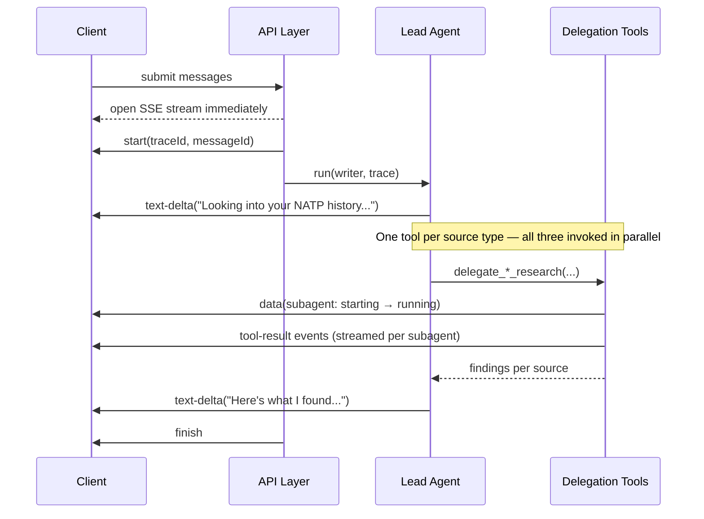
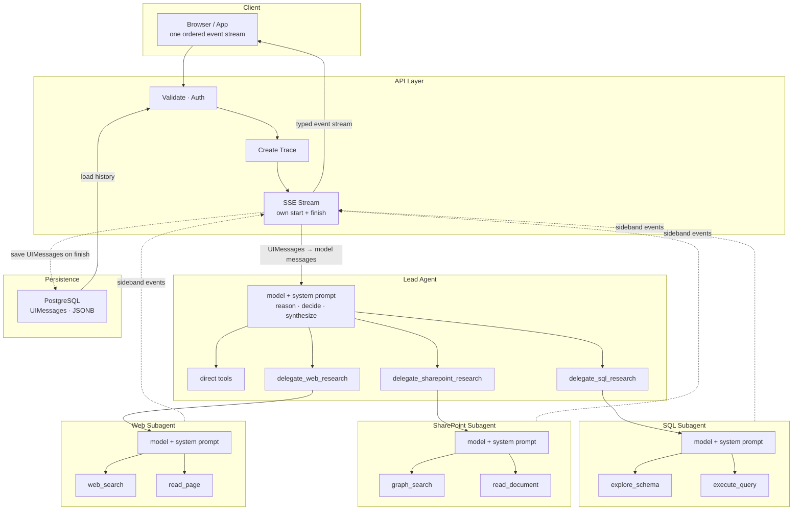

# Architecture Overview

## Recommended Mental Model

Think of this architecture as a **research briefing delivered in real time**.

The **lead agent** is the analyst presenting the briefing. It owns the conversation, decides what needs investigating, and delivers the final answer. When a question spans multiple data sources, it hands off assignments to **subagents** — specialists who each own one lane of work, run their own tool loops, and report their findings back.

The **client** never interacts with those specialists directly. It opens a **Server-Sent Events (SSE)** connection and receives a sequence of **typed events**: text as the assistant writes, progress markers as subagents check in, tool activity as evidence is gathered, a terminal finish when the work is done. The UI renders those events — it does not parse prose to guess what is happening.

**Tracing** connects all of this into one inspectable execution. Every tool call, every subagent span, and every model generation is recorded as a child of the same root trace. When something goes wrong, you follow one trace from the top-level request all the way into a subagent's seventh tool call.

The result is a system whose internal complexity can grow — more subagents, deeper delegation, longer tool chains — without any of that surfacing to the client, the UI, or the user.

## Overview

A multi-agent system should behave like **one conversation with one stream**, even when multiple specialized agents are working concurrently. This document describes the layers that make that possible and the design principles that keep each layer stable under real production load.

The NATP scenario from the introduction maps directly onto this architecture: the lead agent receives the prompt, delegates to SQL, SharePoint, and web research subagents in parallel, merges their activity back into a single stream, and synthesizes the final answer.

## How a Turn Works

The following sequence covers a typical multi-agent turn from request through delegation to finish:



Three things to notice:

- The stream opens and returns to the client **before** the lead agent starts. The client never polls or waits for a complete response.
- Each research source gets its **own delegation tool** — the model can return all of them in one step and they execute in parallel, each internally running its own subagent loop.
- The **API Layer** owns both the `start` and `finish` events. Inner agents suppress their own terminal markers.

## Runtime Layers

Each agent is **model + system prompt + tools**. No layer should know more about the system than its role requires.



## The SSE Stream

The client-facing stream is a **Server-Sent Events (SSE)** connection — an HTTP response that stays open and pushes named events as they arrive. The server writes one event at a time; the client reads them in order.

Below is what you'd see in the Chrome DevTools **EventStream** tab for the NATP turn. Each row is one SSE `data:` event. All events are `type: message`; the `type` field inside the JSON identifies what it carries.

```
 Type      Data                                                                                         Time
────────────────────────────────────────────────────────────────────────────────────────────────────────────────
 message   {"type":"start","messageId":"msg_0j3kp9","messageMetadata":{"traceId":"tr_7x2mn1"}}          12:27:19.788
 message   {"type":"start-step"}                                                                        12:27:19.790
 message   {"type":"text-delta","delta":"Looking into your NATP history..."}                            12:27:19.835
 message   {"type":"tool-call","toolCallId":"tc_0","toolName":"delegate_sql_research","args":{...}}     12:27:19.980
 message   {"type":"tool-call","toolCallId":"tc_1","toolName":"delegate_sharepoint_research","args":{}} 12:27:19.981
 message   {"type":"tool-call","toolCallId":"tc_2","toolName":"delegate_web_research","args":{...}}     12:27:19.982
 message   {"type":"finish-step","finishReason":"tool-calls","isContinued":true}                        12:27:20.010
 message   {"type":"data","data":{"type":"subagent","id":"sql-1","status":"starting"}}                  12:27:20.020
 message   {"type":"data","data":{"type":"subagent","id":"sp-1","status":"starting"}}                   12:27:20.021
 message   {"type":"data","data":{"type":"subagent","id":"web-1","status":"starting"}}                  12:27:20.022
 message   {"type":"data","data":{"type":"subagent","id":"sql-1","status":"running"}}                   12:27:20.890
 message   {"type":"tool-result","toolCallId":"tc_0","result":{"projects":[...]}}                       12:27:26.100
 message   {"type":"data","data":{"type":"subagent","id":"sql-1","status":"completed"}}                 12:27:26.120
 message   {"type":"tool-result","toolCallId":"tc_1","result":{"files":[...]}}                          12:27:28.200
 message   {"type":"data","data":{"type":"subagent","id":"sp-1","status":"completed"}}                  12:27:28.210
 message   {"type":"tool-result","toolCallId":"tc_2","result":{"summary":"NATP announced..."}}          12:27:29.800
 message   {"type":"data","data":{"type":"subagent","id":"web-1","status":"completed"}}                 12:27:29.810
 message   {"type":"start-step"}                                                                        12:27:29.850
 message   {"type":"text-delta","delta":"Here's what I found across three sources..."}                  12:27:29.900
 message   {"type":"finish-step","finishReason":"stop","isContinued":false}                             12:27:31.200
 message   {"type":"finish","finishReason":"stop","usage":{"promptTokens":5200,"completionTokens":380}} 12:27:31.205
```

The UI renders each `type` differently: `text-delta` chunks stream into the assistant message bubble, `data` events update the subagent progress cards, `tool-call`/`tool-result` pairs populate collapsible tool call rows, and `finish` marks the turn complete. None of this requires parsing prose.

## Architectural Principles

### 1. One client-facing SSE stream per turn

The API Layer opens the SSE connection and returns it to the client immediately. Everything else — lead agent output, tool activity, subagent events — feeds into that same stream. The client never has to merge independent sockets or guess which channel is authoritative.

→ See [Request Flow & Streaming](./02-request-flow-and-streaming.md) for the full treatment.

### 2. The lead agent owns user-visible orchestration

The lead agent is the only agent that should directly own the user-facing response strategy. It decides whether to answer directly, call a tool, or delegate. Subagents do not speak to the user — they report back to the lead agent, which synthesizes the final response.

→ See [Agent Architecture](./03-agent-architecture.md) for prompt structure, tool registry design, and step guardrails.

### 3. Tools are the boundary between orchestration and execution

Two tool classes emerge in practice:

- **Direct tools**: return data from a single call (lookups, searches, formatting).
- **Delegation tools**: each wraps one specialized subagent. The lead agent calls a separate tool per research type — `delegate_sql_research`, `delegate_sharepoint_research`, `delegate_web_research` — and the tool implementation runs the subagent's loop, streams its activity, and returns a normalized result.

This boundary keeps the lead agent focused on reasoning. It does not manage subagent lifecycles, retry logic, or stream merging — each delegation tool does that for its own subagent.

→ See [Subagent Fan-Out Pattern](./04-subagent-fanout-pattern.md) for delegation tool design.

### 4. Subagents are execution units, not peer conversational agents

A subagent has a narrow job, a reduced toolset, and a bounded runtime. It does iterative work — exploring a schema, querying and retrying, reading documents — and returns a compact artifact to the delegation tool. It is not a general-purpose assistant and should not behave like one.

→ See [Specialized Execution Subagent](./07-sql-subagent-deep-dive.md) for end-to-end subagent design.

## Trace Propagation

One user turn should map to one distributed trace. The API Layer creates a root trace, writes the `traceId` into the SSE `start` event immediately, and propagates trace context into the lead agent and from there into every delegated subagent. Each subagent's tool call spans appear as children of that root.

Without this, a three-subagent turn looks like four unrelated traces in Langfuse. With it, you can follow the execution from the root all the way into any subagent's individual tool calls, with exact latency and token usage visible at each level.

→ See [Telemetry & Tracing](./08-telemetry-and-tracing.md) for implementation details.

## Design Guidance

### What to keep stable

If you are adapting this pattern for another system, these are the invariants worth preserving:

- One client-facing SSE stream per turn
- One lead agent owning the visible answer
- Tool boundaries for all external execution
- Delegation tools owning fan-out and recovery policy
- Typed sideband events for delegated lifecycle state
- Defensive stream normalization before merge
- End-to-end trace propagation
- UIMessages persisted after the stream finishes; converted to ModelMessages on the next read

### What to vary by product

These details should remain product-specific:

- The exact tool catalog
- How subagents are prompted
- How many subagents may run concurrently
- Which sideband event types the UI renders
- What counts as partial success

## Key Takeaways

- The architecture is one user-facing SSE stream backed by a lead agent with specialized delegated workers.
- Each layer has a single responsibility: the API Layer owns the SSE stream, the lead agent owns the response strategy, delegation tools own fan-out policy, subagents own narrow task execution.
- The SSE stream is an ordered sequence of typed events. The UI renders each event type — it does not parse prose.
- Trace context must propagate from the API Layer through the lead agent into every subagent.
- Partial success is a first-class outcome, not an error state — design for it explicitly.

## Related Sections

- [02 - Request Flow & Streaming](./02-request-flow-and-streaming.md): HTTP transport, stream creation, and event filtering
- [03 - Agent Architecture](./03-agent-architecture.md): Lead agent configuration, prompts, and guardrails
- [04 - Subagent Fan-Out Pattern](./04-subagent-fanout-pattern.md): Delegation tool design and stream merging
- [07 - Specialized Execution Subagent](./07-sql-subagent-deep-dive.md): End-to-end subagent design
- [08 - Telemetry & Tracing](./08-telemetry-and-tracing.md): Trace propagation and Langfuse integration
- [09 - Conversation Persistence](./09-conversation-persistence.md): Persisting conversation state and message history
