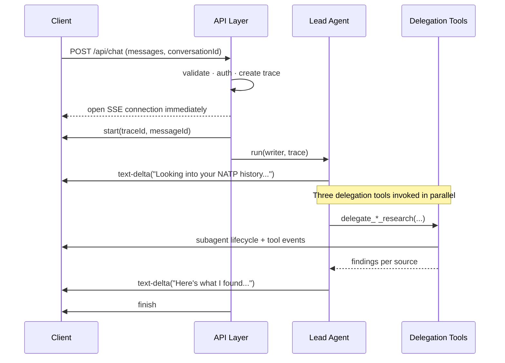

# Request Flow & Streaming

## Overview

When the example turn runs, three subagents work in parallel, each producing its own stream of events. The client sees none of that complexity. It opens one SSE connection and receives a clean, ordered sequence of events: the lead agent's text, tool activity from all three subagents, progress markers as each one finishes, and a single `finish` when the whole turn is done.

That experience requires deliberate choices about who owns the stream, how subagent output gets merged, and what gets filtered before it reaches the client. This document covers those mechanics.

## How a Request Establishes the Stream

The API Layer handles everything that needs to happen before the first byte of agent output arrives:



Three things happen before the lead agent takes a single step:

1. The API Layer validates the request and authenticates the user.
2. A root trace is created and a `traceId` is assigned.
3. The SSE connection opens and returns to the client immediately.

The client starts receiving events before any agent work begins. It never polls. It never waits for a complete response.

In code, the API route creates the stream, runs the agent inside it, and returns the stream as the HTTP response, all in one pass:

```typescript
// app/chat/routes/api.chat.ts
export const action = async ({ request }: Route.ActionArgs) => {
  const { user } = await requireAuth(request);
  const { messages, conversationId } = ChatInputSchema.parse(await request.json());

  // Client sends UIMessages (renderable shape); providers want ModelMessages (role+content).
  const modelMessages = convertToModelMessages(messages);

  const stream = createUIMessageStream({
    execute: ({ writer }) => {
      // Writer is passed into the agent so every layer below writes to the same SSE stream.
      const agent = createLeadAgent({ writer });

      writer.merge(
        agent.stream({ messages: modelMessages }).toUIMessageStream({
          sendStart: false,   // API layer already emitted "start" with traceId.
          sendFinish: false,  // API layer emits the single authoritative "finish".
          messageMetadata: ({ part }) => {
            // Attach traceId to the start event so the UI can link back to the trace in Langfuse.
            if (part.type === "start") return { traceId: trace.id };
          },
          onFinish: async ({ messages: finalMessages }) => {
            // Persist only after the stream settles. Mid-run crashes are handled separately.
            await saveConversation({ id: conversationId, messages: finalMessages });
          },
        })
      );
    },
  });

  // Wraps the stream in an HTTP response with Content-Type: text/event-stream.
  return createUIMessageStreamResponse({ stream });
};
```

`createUIMessageStreamResponse` returns the stream as an HTTP response with the correct `Content-Type: text/event-stream` headers. The client starts reading immediately.

## One Stream, Many Writers

The SSE connection is owned by the API Layer. Everything below it (the lead agent, delegation tools, subagents) receives a shared **writer** passed down from the top.

```
API Layer creates SSE stream
    │
    └── passes writer to Lead Agent
            │
            ├── passes writer to delegate_sql_research
            │       └── SQL Subagent writes tool events via same writer
            │
            ├── passes writer to delegate_sharepoint_research
            │       └── SharePoint Subagent writes tool events via same writer
            │
            └── passes writer to delegate_web_research
                    └── Web Subagent writes tool events via same writer

All events funnel into one ordered SSE stream → Client
```

The writer has one job: emit events into the stream. It does not know about HTTP, SSE framing, or which layer called it. This is what makes the pattern composable. You can pass the writer into any tool, any subagent, any depth of delegation, and events will always surface in the right place.

The lead agent receives the writer through its factory and threads it into each delegation tool:

```typescript
// app/agents/lead/leadAgent.server.ts
export function createLeadAgent(config: {
  // Optional so the same agent factory can run outside a streaming context (evals, CLI, tests).
  writer?: UIMessageStreamWriter<UIMessage>;
}) {
  // Each delegation tool receives the same writer, so subagent events surface in the parent stream
  // without any tool knowing about HTTP or SSE framing.
  const tools = {
    delegate_sql_research: createSqlResearchTool({ writer: config.writer }),
    delegate_sharepoint_research: createSharePointResearchTool({ writer: config.writer }),
    delegate_web_research: createWebResearchTool({ writer: config.writer }),
  };

  return new Agent({
    model: modelRegistry.languageModel("default:leadAgent"),
    system: leadAgentSystemPrompt,
    tools,
  });
}
```

Tools that do not need to stream can treat the writer as optional. They just skip emitting sideband events.

## Sideband Events: Tracking Subagent Progress

The SSE stream carries both user-visible content (`text-delta`, `tool-call`) and **sideband events**: structured status updates the UI uses to track subagent progress. These arrive as `{"type":"data", ...}` events, not as text. The UI renders them as collapsible progress cards, not as assistant prose.

Each delegation tool is responsible for emitting its subagent's lifecycle: `starting → running → completed` (or `error`). A shared helper handles this:

```typescript
// toolkit/ai/subagentDataWriter.ts
export async function handleSubAgentStream(
  streamResult: StreamTextResult<ToolSet>,
  { writer, name, parentToolCallId }: {
    writer: UIMessageStreamWriter<UIMessage>;
    name: string;
    parentToolCallId: string;
  }
) {
  // Stable id ties starting → running → completed events to one progress card in the UI.
  const subagentId = generateId();

  // "starting" fires immediately so the card appears before any tool calls run.
  writeSubagentData(writer, {
    subagentId, name, parentToolCallId, status: "starting",
  });

  const subStream = streamResult.toUIMessageStream({
    sendStart: false,   // Outer turn owns start/finish. Multiple finish events would confuse the client.
    sendFinish: false,
  });

  // First tool-input-start means the subagent is actually doing work, not just spinning up.
  const annotatedStream = mapUIMessageStream(subStream, ({ chunk }) => {
    if (chunk.type === "tool-input-start") {
      writeSubagentData(writer, {
        subagentId, name, parentToolCallId, status: "running",
      });
    }
    return chunk;
  });

  // writer.merge namespaces the subagent's tool-call IDs so parallel subagents don't collide.
  writer.merge(annotatedStream);

  // Without consumeStream the subagent never actually runs. Streams are lazy.
  await streamResult.consumeStream();
  writeSubagentData(writer, {
    subagentId, name, parentToolCallId, status: "completed",
  });
}
```

Here is what the DevTools EventStream tab looks like as the three NATP subagents start and complete:

```
 Type      Data                                                                          Time
─────────────────────────────────────────────────────────────────────────────────────────────
 message   {"type":"finish-step","finishReason":"tool-calls","isContinued":true}         12:27:20.010
 message   {"type":"data","data":{"type":"subagent","id":"sql-1","status":"starting"}}   12:27:20.020
 message   {"type":"data","data":{"type":"subagent","id":"sp-1","status":"starting"}}    12:27:20.021
 message   {"type":"data","data":{"type":"subagent","id":"web-1","status":"starting"}}   12:27:20.022
 message   {"type":"data","data":{"type":"subagent","id":"sql-1","status":"running"}}    12:27:20.890
 message   {"type":"tool-result","toolCallId":"tc_0","result":{"projects":[...]}}        12:27:26.100
 message   {"type":"data","data":{"type":"subagent","id":"sql-1","status":"completed"}}  12:27:26.120
 message   {"type":"tool-result","toolCallId":"tc_1","result":{"files":[...]}}           12:27:28.200
 message   {"type":"data","data":{"type":"subagent","id":"sp-1","status":"completed"}}   12:27:28.210
 message   {"type":"tool-result","toolCallId":"tc_2","result":{"summary":"..."}}}        12:27:29.800
 message   {"type":"data","data":{"type":"subagent","id":"web-1","status":"completed"}}  12:27:29.810
```

Each event carries a stable `id` so the UI can match `starting → running → completed` transitions into a single progress card per subagent. Without these explicit markers, the only option is parsing the lead agent's prose to infer when subagents finish, which breaks quickly.

## Filtering Before Merge

Subagent output cannot flow into the parent stream unchanged. The most common problem is **ID collision**: when two subagents run in parallel, each generates its own local tool call IDs. Both might emit a `tool-call` with `toolCallId: "tc_1"`. The client's stream reducer sees two events with the same ID and corrupts shared state.

```
Without remapping (collision):
  SQL subagent emits:        {"type":"tool-call","toolCallId":"tc_1","toolName":"explore_schema"}
  SharePoint subagent emits: {"type":"tool-call","toolCallId":"tc_1","toolName":"graph_search"}
  → reducer sees two "tc_1" events → state corruption

With remapping:
  SQL subagent emits:        {"type":"tool-call","toolCallId":"sql_tc_1","toolName":"explore_schema"}
  SharePoint subagent emits: {"type":"tool-call","toolCallId":"sp_tc_1","toolName":"graph_search"}
  → every event is unique → clean merge
```

`writer.merge()` handles ID remapping automatically. Each merged stream's IDs are namespaced before they enter the parent. You do not need to do this manually.

Beyond ID remapping, the `handleSubAgentStream` helper also:

- **Strips `start`/`finish` events** from subagent output (`sendStart: false`, `sendFinish: false`): only the outer turn emits these
- **Filters reasoning parts**: useful inside a subagent loop but noise in the merged stream
- **Tracks tool call IDs** inline to keep sideband lifecycle events accurate

## Partial Results Are Normal

Not every subagent will finish cleanly on every turn. The SharePoint Graph API might be slow. A SQL query might time out. The right response is not to fail the whole turn. It is to complete what can be completed and label what couldn't.

For the NATP turn, if SharePoint times out:

```
▼ SQL Agent          [8 tool calls]  ✓ done
▼ SharePoint Agent   [2 tool calls]  ⚠ partial: Graph API timeout after 8s
▼ Web Research       [3 tool calls]  ✓ done

Answer: "I found 2 past NATP engagements in the project database and recent
public news about their AI initiative. I wasn't able to retrieve the pre-sales
folder from SharePoint. It timed out. You may want to check that manually."
```

This is a better outcome than an error page. The lead agent has enough to produce a useful answer. It just needs to acknowledge the gap explicitly.

In code, a delegation tool handles this by catching the failure and returning structured partial output instead of throwing:

```typescript
// app/agents/lead/tools/delegateSharePointResearch.ts
export const createSharePointResearchTool = (options: {
  writer?: UIMessageStreamWriter<UIMessage>;
}) =>
  tool({
    description: "Search the pre-sales SharePoint folder for artifacts related to the user prompt.",
    inputSchema: z.object({ query: z.string() }),
    execute: async ({ query }, ctx) => {
      try {
        const agent = createSharePointAgent();
        const result = await agent.stream({
          messages: [{ role: "user", content: query }],
        });

        // Writer is optional so the tool still works in non-streaming contexts (evals, tests).
        if (options.writer) {
          await handleSubAgentStream(result, {
            writer: options.writer,
            name: "SharePoint Research",
            parentToolCallId: ctx.toolCallId,
          });
        }

        return { status: "completed", findings: await result.steps };
      } catch (error) {
        // Catch, don't throw. Throwing bubbles up and kills the parent turn.
        // Instead, surface the failure as a sideband "error" so the UI shows ⚠ instead of spinning forever.
        writeSubagentData(options.writer, {
          subagentId: ctx.toolCallId,
          name: "SharePoint Research",
          status: "error",
          parentToolCallId: ctx.toolCallId,
        });

        // status: "partial" is a first-class signal to the lead agent.
        // It can acknowledge the gap in its answer ("I couldn't reach SharePoint...") instead of pretending it succeeded.
        return {
          status: "partial",
          error: error instanceof Error ? error.message : "unknown error",
          findings: [],
        };
      }
    },
  });
```

The lead agent receives the `{status: "partial"}` return value and can reference the gap explicitly in its answer.

## One Owner for Finish

Exactly one layer decides when the turn is done: the API Layer.

Inner agents do not emit `finish`. Delegation tools do not emit `finish`. Subagents suppress their own terminal markers via `sendFinish: false`. The only `finish` event the client ever sees comes from the API Layer, after all agent work has settled.

This matters because the client uses `finish` to mark the assistant message complete, re-enable the input field, and trigger post-turn persistence. If subagents emitted their own `finish` events, the client would see multiple competing terminals, and the UI would flash complete while the lead agent is still synthesizing.

The `sendStart: false` / `sendFinish: false` options on `toUIMessageStream()` are how inner agents opt out:

```typescript
agent.stream({ messages }).toUIMessageStream({
  sendStart: false,   // API layer already emitted "start".
  sendFinish: false,  // API layer will emit the authoritative "finish".
  // ...
});
```

## Error Handling: Two Levels

There are two distinct failure modes that need different responses.

**Inner errors**: a subagent fails, a tool times out, a data source returns an error. These do not end the turn. The delegation tool catches the failure, emits a `partial` sideband event, and returns whatever it managed to produce. The lead agent treats it as a gap in evidence and synthesizes accordingly.

**Outer errors**: the turn itself cannot continue. The API Layer catches this, emits a terminal `error` event (or a graceful fallback message), and marks the turn done.

```
Inner error (delegation tool handles it):
  SharePoint subagent → timeout
  delegate_sharepoint_research → returns { status: "partial", findings: [], error: "timeout" }
  Lead agent → synthesizes answer, notes the SharePoint gap
  API Layer → emits finish normally

Outer error (API Layer handles it):
  Lead agent → model provider returns 5xx
  API Layer → emits { "type": "error", "error": "model_unavailable" }
  Turn ends. Client shows error state.
```

The key rule: an inner error should never automatically become an outer error. A subagent failing is not the same as the turn failing.

## Key Takeaways

- The API Layer opens the SSE connection and returns it to the client before any agent work begins.
- A shared writer is threaded down through agents, tools, and subagents. Everyone writes to the same stream without knowing about transport.
- Sideband `data` events carry subagent lifecycle state; the UI renders them as progress cards, not prose.
- `writer.merge()` handles ID remapping automatically when combining parallel subagent streams.
- Subagent streams should suppress their own `start`/`finish` events: the outer turn owns those.
- Partial results are a first-class outcome: delegation tools should return structured partial output, not just throw.
- One owner (the API Layer) emits `finish`. Inner agents suppress their own terminal markers.
- Inner errors are handled by delegation tools; only unrecoverable failures become outer errors.

## Related Sections

- [01 - Architecture Overview](./01-architecture-overview.md): The full runtime layer diagram and SSE event format
- [04 - Subagent Fan-Out Pattern](./04-subagent-fanout-pattern.md): Delegation tool design and stream merging in detail
- [09 - Conversation Persistence](./09-conversation-persistence.md): How UIMessages are saved after the stream finishes
- [10 - Error Handling & Limits](./10-error-handling-and-limits.md): Budget guardrails, convergence, and failure handling
