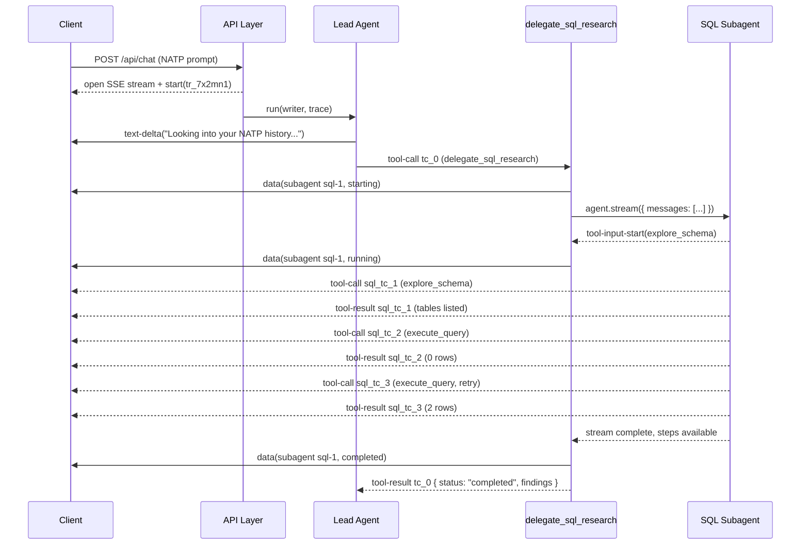

# Subagent Fan-Out Pattern

## Overview

When the user asks a question, the lead agent decides — in a single reasoning step — that it needs three different data sources. It issues three tool calls at once. Each call is a **delegation tool**: a thin wrapper that spins up a specialized **subagent**, threads the parent stream down into it, and returns a normalized result when the subagent is done.

```
Lead Agent
├── delegate_sql_research         → SQL Subagent        (~8 tool calls)
├── delegate_sharepoint_research  → SharePoint Subagent (Graph API)
└── delegate_web_research         → Web Subagent        (public news)
```

This chapter documents the pattern that makes that work: one delegation tool per source, shared stream merging, typed **sideband events** for lifecycle state, and a **partial result** envelope when one branch fails.

For .NET readers: a **tool** is a function the model can invoke during a turn — the LLM sees a name, a description, and a JSON schema for inputs, and the runtime calls your code when the model chooses it. An **SSE stream** is a long-lived HTTP response that pushes typed events to the client as they happen. A **stream writer** is the handle used to push an event. The delegation pattern below is built on these three primitives.

## One Tool Per Source, Not One Polymorphic Tool

An obvious-looking shortcut is to expose a single tool:

```typescript
// app/agents/lead/tools/delegateResearch.ts — AVOID THIS SHAPE
delegate_research({ type: "sql" | "sharepoint" | "web", query: string })
```

Do not do this. Three separate tools are better in every practical way.

- **True parallelism.** Most LLM APIs let the model emit multiple tool calls in one assistant step, but only when the tool *names* differ. If the model wants to call `delegate_research` three times, it usually serializes into three separate reasoning steps. Separate tool names unlock one-step fan-out.
- **Input schemas can diverge.** The SQL subagent wants instructions and a complexity hint. SharePoint wants a folder scope plus a query. Web wants recency bias and domain filters. Merging these into one schema forces every field to be optional, and the model loses the type-level guidance.
- **Per-tool prompt guidance.** Each delegation tool carries its own description and usage rules — when to call it, what it costs, what it returns. One polymorphic tool collapses that into a single blob that reads like a user manual.
- **Independent traceability.** Each delegation tool call becomes its own span in the distributed trace, attributed to the subagent it launched. The union shape hides which subagent cost 6 seconds and which one timed out.

The rule: **one delegation tool per source**. The lead agent's tool registry stays wide and flat; the model picks any subset in one step.

## Three Responsibilities

The pattern splits cleanly into three layers, each with one job.

```
┌─ Delegation Tool ──────────────────────────────────────────────┐
│  Orchestration: validate input, create subagent, thread the    │
│  writer, enforce timeout, catch errors, normalize return value │
└────────────────────────────────────────────────────────────────┘
                            │ spawns
                            ▼
┌─ Subagent ─────────────────────────────────────────────────────┐
│  Task execution: its own tool loop, domain tools only,         │
│  bounded stopWhen, produces draft + findings                   │
└────────────────────────────────────────────────────────────────┘
                            │ emits events via
                            ▼
┌─ Parent Stream ────────────────────────────────────────────────┐
│  User-visible coordination: merged child tool activity +       │
│  sideband lifecycle events for the UI's progress cards         │
└────────────────────────────────────────────────────────────────┘
```

- The **delegation tool** owns orchestration. It validates the model's input, constructs the subagent, passes the shared writer into it, enforces a timeout, catches errors, and turns whatever happened into a predictable envelope.
- The **subagent** owns task execution. It runs its own tool loop with its own domain tools (schema exploration, query execution, Graph API calls, web search) and has a bounded `stopWhen` so it terminates on its own. It never talks to the user directly.
- The **parent stream** owns user-visible coordination. The merged child tool activity populates tool-call rows in the UI; the sideband lifecycle events drive the subagent progress cards.

## Sequence of One Delegation

Here is what the SQL branch of the NATP turn looks like from request to result:



Three things to notice:

- The lead agent sees one tool call (`tc_0`) and one tool result. The many child events in between are merged into the same SSE stream, but the lead agent's model messages only ever see the result envelope.
- The sideband `data(subagent ...)` events flow alongside the merged tool activity — they are not generated by the model and they do not become prose. They exist purely for the UI.
- The subagent's local tool call IDs (`tc_1`, `tc_2`, `tc_3`) get prefixed to `sql_tc_1`, `sql_tc_2`, `sql_tc_3` before they enter the parent stream. Without that remapping, the three NATP subagents running in parallel would all emit a `tc_1` and collide.

## A Delegation Tool, Concretely

Every delegation tool is built the same way: a factory that closes over the shared writer and returns a `tool({...})` definition.

```typescript
// app/agents/lead/tools/delegateSqlResearch.ts
import { generateId, tool, type UIMessage, type UIMessageStreamWriter } from "ai";
import { z } from "zod";
import { createSqlSubagent } from "~/agents/sql/sqlSubagent.server";
import { handleSubAgentStream } from "~/toolkit/ai/subagentDataWriter";

const SqlResearchInput = z.object({
  instructions: z.string().describe("What the SQL agent should investigate."),
  summaryTitle: z.string().describe("Short label for the UI progress card."),
});

export const createSqlResearchTool = <TUIMessage extends UIMessage>(options: {
  writer?: UIMessageStreamWriter<TUIMessage>;
}) =>
  tool({
    description: "Query the project database for past engagements, staffing, and billing history.",
    inputSchema: SqlResearchInput,
    execute: async ({ instructions, summaryTitle }, { toolCallId, abortSignal }) => {
      const subagent = createSqlSubagent({
        // Subagent gets its own model, prompt, and narrow toolset.
        // Bounded by stopWhen so it terminates without the tool having to police it.
        abortSignal,
      });

      const result = await subagent.stream({
        messages: [{ role: "user", content: instructions }],
      });

      // Merge child tool activity into the parent SSE stream AND emit
      // sideband lifecycle events the UI uses to render progress cards.
      if (options.writer) {
        await handleSubAgentStream(result, {
          writer: options.writer,
          name: summaryTitle,
          parentToolCallId: toolCallId ?? generateId(),
        });
      }

      const steps = await result.steps;
      return {
        status: "completed" as const,
        findings: extractFindings(steps),     // normalize to a stable schema
      };
    },
  });

function extractFindings(steps: unknown) { /* ... */ }
```

A few deliberate choices:

- The factory takes `writer` as an option, not a required argument. That keeps delegation tools testable in isolation — you can call `execute` without a stream attached and the tool still returns a valid result.
- The subagent is constructed fresh per call. It carries no state between turns and no state between sibling calls. This is why restarts, retries, and partial failures compose cleanly.
- `abortSignal` is propagated into the subagent. If the parent request is cancelled, every in-flight subagent winds down.
- The return value has a `status` discriminator. The lead agent will branch on it when the other two tools come back as `partial` or `error`.

## Sideband Lifecycle Events

The parent stream carries two kinds of traffic. User-visible content — text deltas, tool calls, tool results — is what the lead agent's messages are made of. **Sideband events** are structured status updates that are not part of any message, shaped as `{type: "data", data: {...}}` entries. The UI consumes them to render progress cards; the model never sees them.

The event payload is small and stable:

```typescript
type SubagentData = {
  subagentId: string;                                   // stable id for UI match-up
  name: string;                                          // "SQL Research", "SharePoint Research"
  status: "starting" | "running" | "completed" | "error";
  parentToolCallId: string;                              // links to lead agent's tool-call
  toolCallIds: string[];                                 // child tool calls discovered so far
};
```

Three events arrive during a clean run, in order:

```
{"type":"data","data":{"type":"subagent","id":"sql-1","status":"starting","name":"SQL Research",...}}
{"type":"data","data":{"type":"subagent","id":"sql-1","status":"running","name":"SQL Research",...}}
{"type":"data","data":{"type":"subagent","id":"sql-1","status":"completed","name":"SQL Research",...}}
```

Why separate these from merged tool-call chunks at all? Because the UI needs to render progress cards *without parsing prose or inferring from tool names*. A progress card's state machine is `starting → running → completed | error`. Mapping that onto ambiguous signals ("did the last tool finish? is there more coming?") breaks the moment a subagent pauses between tool calls or finishes cleanly with no tool calls at all. Typed lifecycle events keep the UI honest.

The `starting` event fires before the subagent takes its first step — the card appears immediately. The `running` event fires on the first `tool-input-start` chunk — the card switches from "initializing" to showing a live tool count. `completed` or `error` fires when the stream drains.

## The Shared Helper

Every delegation tool calls one shared helper. The helper owns the merge, the lifecycle events, and the filter rules. Writing it once means every subagent behaves consistently.

```typescript
// toolkit/ai/subagentDataWriter.ts
import { filterUIMessageStream, mapUIMessageStream, excludeParts } from "ai-stream-utils";
import {
  generateId,
  type StreamTextResult,
  type ToolSet,
  type UIMessage,
  type UIMessageStreamWriter,
} from "ai";

export async function handleSubAgentStream<TTools extends ToolSet>(
  streamResult: StreamTextResult<TTools>,
  {
    writer,
    name,
    parentToolCallId,
  }: {
    writer: UIMessageStreamWriter<UIMessage>;
    name: string;
    parentToolCallId: string;
  }
) {
  const subagentId = generateId();
  const toolIds = new Set<string>();

  // 1. Emit "starting" before any work begins — the UI card appears instantly.
  writeSubagentData(writer, {
    subagentId, name, parentToolCallId, status: "starting", toolCallIds: [],
  });

  // 2. Convert the subagent's internal stream into a UI-message stream.
  //    sendStart/sendFinish: false — the API Layer already emitted those for the turn.
  //    sendReasoning: true — the subagent's chain-of-thought is kept for debugging,
  //    but we filter it out below before merging into the parent.
  const subStream = streamResult.toUIMessageStream({
    sendStart: false,
    sendFinish: false,
    sendReasoning: true,
  });

  // 3. Strip reasoning parts (noise in merged stream, useful in raw trace only).
  const filtered = filterUIMessageStream(subStream, excludeParts(["reasoning"]));

  // 4. Watch for tool-input-start chunks to flip status → "running",
  //    and for error chunks to flip status → "error" and bubble.
  const annotated = mapUIMessageStream(filtered, ({ chunk }) => {
    if (chunk?.type === "tool-input-start") {
      toolIds.add(chunk.toolCallId);
      writeSubagentData(writer, {
        subagentId, name, parentToolCallId,
        status: "running",
        toolCallIds: Array.from(toolIds),
      });
    }
    if (chunk?.type === "error") {
      writeSubagentData(writer, {
        subagentId, name, parentToolCallId,
        status: "error",
        toolCallIds: Array.from(toolIds),
      });
      throw new Error(chunk.errorText);
    }
    return chunk;
  });

  // 5. writer.merge() handles ID remapping — every chunk id (tool-call ids, text-part
  //    ids, reasoning ids) is namespaced before it lands in the parent stream.
  writer.merge(annotated);

  // 6. Drain the stream, then emit "completed".
  await streamResult.consumeStream();
  writeSubagentData(writer, {
    subagentId, name, parentToolCallId,
    status: "completed",
    toolCallIds: Array.from(toolIds),
  });
}
```

The helper is small but every line pays for itself. A delegation tool that skipped it — merging the raw stream directly with `writer.merge` — would lose lifecycle events, leak reasoning chunks, and keep the stream open after errors instead of flipping to `error` and bubbling.

## ID Collision and Why `writer.merge` Saves You

Parallel subagents each generate their own local IDs. Without namespacing, the three NATP subagents all emit a `tool-call` with `toolCallId: "tc_1"` in roughly the same millisecond window. The client-side stream reducer sees duplicate IDs and corrupts its state — tool calls bleed into each other, results get attached to the wrong caller.

```
Without remapping (collision):
  SQL subagent emits:        {"type":"tool-call","toolCallId":"tc_1","toolName":"execute_query"}
  SharePoint subagent emits: {"type":"tool-call","toolCallId":"tc_1","toolName":"graph_search"}
  Web subagent emits:        {"type":"tool-call","toolCallId":"tc_1","toolName":"web_search"}
  → reducer sees three "tc_1" events → state corruption

With remapping:
  SQL subagent emits:        {"type":"tool-call","toolCallId":"sql_tc_1","toolName":"execute_query"}
  SharePoint subagent emits: {"type":"tool-call","toolCallId":"sp_tc_1","toolName":"graph_search"}
  Web subagent emits:        {"type":"tool-call","toolCallId":"web_tc_1","toolName":"web_search"}
  → every event is unique → clean merge
```

`writer.merge()` automatically prefixes every chunk-level ID on the way in. Text part IDs, reasoning IDs, and tool call IDs are all namespaced per merged stream. You do not do this by hand — but you do have to remember to route every subagent stream through `writer.merge` rather than writing chunks directly.

The companion options on `toUIMessageStream` are just as important:

```typescript
streamResult.toUIMessageStream({
  sendStart: false,   // API layer already emitted start with the turn's messageId + traceId
  sendFinish: false,  // API layer will emit the single finish after the lead agent settles
});
```

If a subagent emitted its own `start`, the client would see two "new message" markers in one turn. If it emitted its own `finish`, the input field would re-enable mid-turn while the lead agent was still synthesizing. One owner for `start`, one owner for `finish` — both the API Layer.

## Partial-Result Salvage

The SharePoint Graph API fails more often than the project database does. The right response is not to fail the whole turn — it is to mark that one source as partial and let the lead agent synthesize with the gap acknowledged.

```typescript
// app/agents/lead/tools/delegateSharePointResearch.ts
import { generateId, tool, type UIMessage, type UIMessageStreamWriter } from "ai";
import { z } from "zod";
import { createSharePointSubagent } from "~/agents/sharepoint/sharepointSubagent.server";
import { handleSubAgentStream, writeSubagentData } from "~/toolkit/ai/subagentDataWriter";

const GRAPH_API_TIMEOUT_MS = 8_000;

export const createSharePointResearchTool = <TUIMessage extends UIMessage>(options: {
  writer?: UIMessageStreamWriter<TUIMessage>;
}) =>
  tool({
    description: "Search the pre-sales SharePoint folder for pitch decks, SOW drafts, and prior artifacts.",
    inputSchema: z.object({
      query: z.string(),
      summaryTitle: z.string(),
    }),
    execute: async ({ query, summaryTitle }, { toolCallId, abortSignal }) => {
      // AbortSignal.any — cancel either on parent abort or on our 8s Graph timeout.
      const timeoutSignal = AbortSignal.timeout(GRAPH_API_TIMEOUT_MS);
      const combined = abortSignal
        ? AbortSignal.any([abortSignal, timeoutSignal])
        : timeoutSignal;

      const subagent = createSharePointSubagent({ abortSignal: combined });

      try {
        const result = await subagent.stream({
          messages: [{ role: "user", content: query }],
        });

        if (options.writer) {
          await handleSubAgentStream(result, {
            writer: options.writer,
            name: summaryTitle,
            parentToolCallId: toolCallId ?? generateId(),
          });
        }

        const steps = await result.steps;
        return { status: "completed" as const, findings: extractFindings(steps) };
      } catch (error) {
        // WHY: emit an error sideband so the UI flips the card to ⚠ partial
        // immediately, even before the lead agent synthesizes its final answer.
        writeSubagentData(options.writer, {
          subagentId: toolCallId ?? generateId(),
          name: summaryTitle,
          status: "error",
          parentToolCallId: toolCallId ?? generateId(),
          toolCallIds: [],
        });

        const didTimeout = timeoutSignal.aborted && !abortSignal?.aborted;
        return {
          status: "partial" as const,
          findings: [],
          error: didTimeout
            ? `Graph API timeout after ${GRAPH_API_TIMEOUT_MS / 1000}s`
            : error instanceof Error ? error.message : "unknown error",
        };
      }
    },
  });

function extractFindings(steps: unknown) { /* ... */ }
```

The key rule: **a subagent failing is not the same as the turn failing.** The delegation tool catches the error, emits the sideband, and returns a `partial` envelope. The lead agent reads three tool results (`completed`, `partial`, `completed`) and synthesizes accordingly:

> *"I found 2 past NATP engagements in the project database and recent public news about their AI initiative. I wasn't able to retrieve the pre-sales folder from SharePoint — it timed out. You may want to check that manually."*

The UI shows:

```
▼ SQL Agent           [8 tool calls]  ✓ done
▼ SharePoint Agent    [2 tool calls]  ⚠ partial — Graph API timeout after 8s
▼ Web Research Agent  [3 tool calls]  ✓ done

Answer: I found 2 past NATP engagements...
```

This is a better outcome than an error page. Note that "partial" is not the same as "empty" — if the SharePoint subagent had returned one folder listing before timing out, the tool would return `{status: "partial", findings: [...that one listing], error: "..."}` and the lead agent would use what it got.

## Concurrency and Ordering

All three NATP delegation tools fire from one assistant step. The AI SDK invokes their `execute` functions concurrently, and each one kicks off its own subagent. Three subagent streams interleave into the parent over the next several seconds.

Interleaving is fine because:

- `writer.merge()` is ordered — chunks within a single merged stream arrive in the order the subagent emitted them, even as siblings' chunks weave between them.
- ID remapping keeps every chunk uniquely addressable regardless of arrival order.
- The UI's reducer keys off IDs, not arrival order, so cards and tool rows rebuild deterministically.

If you find you have a reason to cap concurrency — a downstream API with rate limits, or a provider that gets flaky under heavy parallel load — a small async queue in front of subagent construction is enough. Stagger launches by 500ms, or cap in-flight subagents at 6. Both are policy choices that live inside the delegation tool, not in the lead agent or the client.

## The Normalized Result Envelope

Every delegation tool returns the same shape:

```typescript
type DelegationResult<TFindings> =
  | { status: "completed"; findings: TFindings }
  | { status: "partial";   findings: TFindings; error: string }
  | { status: "error";     findings: never[];   error: string };
```

Why normalize this at the tool boundary rather than letting each tool return its natural shape and making the lead agent's prompt handle the variation:

- **The lead agent can branch on `status` without parsing free text.** The system prompt can say: "For any tool result with status=partial, acknowledge the gap in your answer."
- **Downstream telemetry can aggregate.** You can chart completed/partial/error ratios across all delegation tools without special-casing each one.
- **Retry logic is uniform.** If you ever add policy like "retry once on partial," it lives in the lead agent prompt, not split across three tool schemas.

A representative wire slice for the NATP turn, with SharePoint timing out:

```
12:27:20.010  {"type":"finish-step","finishReason":"tool-calls","isContinued":true}
12:27:20.020  {"type":"data","data":{"type":"subagent","id":"sql-1","status":"starting"}}
12:27:20.021  {"type":"data","data":{"type":"subagent","id":"sp-1","status":"starting"}}
12:27:20.022  {"type":"data","data":{"type":"subagent","id":"web-1","status":"starting"}}
12:27:20.890  {"type":"data","data":{"type":"subagent","id":"sql-1","status":"running"}}
12:27:21.102  {"type":"data","data":{"type":"subagent","id":"sp-1","status":"running"}}
12:27:21.340  {"type":"data","data":{"type":"subagent","id":"web-1","status":"running"}}
12:27:26.100  {"type":"tool-result","toolCallId":"tc_0","result":{"status":"completed","findings":[...]}}
12:27:26.120  {"type":"data","data":{"type":"subagent","id":"sql-1","status":"completed"}}
12:27:28.025  {"type":"data","data":{"type":"subagent","id":"sp-1","status":"error"}}
12:27:28.030  {"type":"tool-result","toolCallId":"tc_1","result":{"status":"partial","findings":[],"error":"Graph API timeout after 8s"}}
12:27:29.800  {"type":"tool-result","toolCallId":"tc_2","result":{"status":"completed","findings":{...}}}
12:27:29.810  {"type":"data","data":{"type":"subagent","id":"web-1","status":"completed"}}
```

The sideband events drive the progress cards. The `tool-result` events with a uniform `status` field drive the lead agent's next reasoning step.

## Key Takeaways

- One delegation tool per source, not one polymorphic tool — separate names unlock one-step fan-out, per-tool input schemas, and per-tool trace spans.
- Three responsibilities, three layers: the delegation tool orchestrates, the subagent executes, the parent stream coordinates the UI.
- Lifecycle **sideband events** (`starting → running → completed | error`) are carried as `{type: "data"}` chunks and drive the UI's progress cards without prose parsing.
- `writer.merge()` auto-namespaces child IDs so parallel subagents cannot collide. `sendStart: false` and `sendFinish: false` keep `start`/`finish` ownership with the API Layer.
- A shared helper (`handleSubAgentStream`) standardizes the merge, the filter rules, and the lifecycle events so every delegation tool behaves the same.
- **Partial results** are a first-class outcome. Catch subagent errors at the tool boundary, emit an error sideband, and return `{status: "partial", findings, error}` rather than throwing.
- Every delegation tool returns the same `{status, findings, error?}` envelope so the lead agent can branch uniformly.

## Related Sections

- [01 - Architecture Overview](./01-architecture-overview.md): Where delegation tools sit in the full runtime layer diagram
- [02 - Request Flow & Streaming](./02-request-flow-and-streaming.md): How the shared writer is threaded down and how sideband events appear on the wire
- [03 - Agent Architecture](./03-agent-architecture.md): Lead agent configuration and how delegation tools register in its tool catalog
- [05 - Type Safety & Custom UI Messages](./05-type-safety-and-custom-ui-messages.md): Typing the `SubagentData` payload into the `UIMessage` so the UI can render it safely
- [07 - Specialized Execution Subagent](./07-sql-subagent-deep-dive.md): Inside the SQL subagent — its own tool loop, prompts, and bounded stopWhen
- [08 - Telemetry & Tracing](./08-telemetry-and-tracing.md): How each delegation tool call becomes a span under the turn's root trace
- [10 - Error Handling & Limits](./10-error-handling-and-limits.md): Timeout budgets, abort propagation, and when partial should become hard failure
