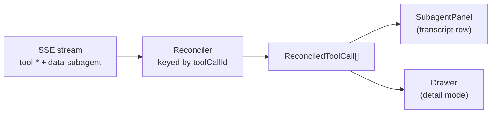

# UI Rendering

## Overview

When the NATP turn reaches the browser, the SSE stream has already done the hard work. The client receives an ordered sequence of **typed parts**: text deltas, tool calls, tool results, and `data-subagent` lifecycle events. The rendering layer's job is to turn that sequence into something a human can read — a live transcript with three subagent progress cards, each expandable into a detailed tool drawer, all updating as bytes arrive.

This chapter covers how to do that without letting streaming semantics leak into every component. The recipe is: render by part type, reconcile by stable identity, split **transcript mode** from **detail mode**, and keep one defensive reader between the wire format and the view.

A quick orientation for .NET readers unfamiliar with React: a "component" here is a plain function that accepts a `props` object and returns JSX — roughly equivalent to a Razor partial that takes a view model. State is held in the component via `useState` and derived values via `useMemo`. Where you would inject a service in C#, a React component receives values through props.

## The Reader's-Eye View

Before looking at code, look at the UI a reader of the NATP turn actually sees:

```
┌────────────────────────────────────────────────────────────────────┐
│ You                                                                │
│ I just had a call with NATP. What projects have we done with       │
│ them in the past, and do we have any pre-sales artifacts already   │
│ saved for this new tax agent project?                              │
├────────────────────────────────────────────────────────────────────┤
│ Assistant                                                          │
│ Looking into your NATP history across project history, pre-sales   │
│ SharePoint, and public announcements...                            │
│                                                                    │
│ ▼ SQL Agent           [8 tool calls]  ✓ done                       │
│ ▼ SharePoint Agent    [2 tool calls]  ⚠ partial — Graph API        │
│                                             timeout after 8s       │
│ ▼ Web Research Agent  [3 tool calls]  ✓ done                       │
│                                                                    │
│ Here's what I found across three sources...                        │
└────────────────────────────────────────────────────────────────────┘
```

That compact stack is the **transcript mode** — one row per subagent, glanceable at a beat. Clicking any row opens a detail drawer that lists every tool call inside that subagent with its input, output, and status. That's **detail mode**. The split keeps the transcript fast even when the SQL subagent has eight tool calls, each with a kilobyte of SQL and a few hundred rows of results.

## Render by `part.type`, Not by Transport Event Shape

Every assistant message arrives as a `UIMessage` with a `parts: UIPart[]` array. Each part carries a discriminator string in `part.type`: `text`, `reasoning`, `tool-delegate_sql_research`, `tool-execute_query`, `data-subagent`, and so on. Dispatch happens on that field, once, at the top of the renderer.

```tsx
// app/chat/components/MessagePart.tsx
import type { AppUIMessage } from "~/chat/types";

type UIPart = AppUIMessage["parts"][number];

export function renderMessagePart(
  part: UIPart,
  ctx: { isStreaming: boolean; allParts: UIPart[] },
) {
  // Subagent lifecycle — one row per subagent in the transcript
  if (part.type === "data-subagent") {
    return <SubagentPanel part={part} allParts={ctx.allParts} />;
  }

  // Direct tool calls the lead agent makes itself (not routed through a subagent)
  if (part.type === "tool-web_search") {
    return <WebSearchResult input={part.input} output={part.output} />;
  }

  // Text chunks stream into the assistant bubble — handled by the outer message
  return null;
}
```

Two decisions are baked in here.

First, **dispatch happens on `part.type`, not on transport event shape**. The backend could change how it frames events, merge streams differently, or compact persisted messages — as long as the part types stay the same, this switch keeps working.

Second, **unknown parts return `null`**. A new part type emitted by a future backend should not crash the message tree. Returning `null` lets the rest of the transcript render while the unknown part is silently dropped. Pair this with structured logging in development so drops are visible without being fatal.

## Transcript Mode vs Detail Mode

The transcript shows one compact row per subagent. The detail drawer shows everything that subagent did. This split is not cosmetic — it controls what gets rendered synchronously while the stream is live.

```
Transcript mode (always rendered)             Detail mode (on click)
────────────────────────────────              ────────────────────────────────
▼ SQL Agent  [8 tool calls] ✓ done    →       Research Instructions
                                              "Find past NATP engagements..."
                                              ────────────────────────
                                              Query 1: explore_schema
                                              Query 2: execute_sql (0 rows)
                                              Query 3: execute_sql (2 rows)
                                              ... 5 more ...
```

Why split them? During the NATP turn, the SQL subagent emits eight `tool-execute_sql` parts, each with a query string, a row count, and a result table. If the transcript row renders every tool call inline, opening the chat tab costs eight table renders on every keystroke while the user types their next question. The detail view does that work only when the drawer opens.

Concretely:

- **Transcript rows** read only summary metadata: the subagent name, the list of `toolCallIds`, the current status, the parent tool-call's instructions. That's enough for the compact row.
- **Detail drawers** hydrate the full tool parts — `input`, `output`, and `state` for each `toolCallId` — and group them for display. Hydration can be from the already-streamed parts in memory or from a server fetch when the transcript has been compacted for storage.

The contract between the two modes is simple: the transcript row must be accurate even when only the subagent summary exists. Never assume the full tool output is present just because a drawer might open later.

## Map Stream States to UI States Once

The AI SDK emits four tool states: `input-streaming`, `input-available`, `output-available`, and `output-error`. Components should not switch on those strings directly — too easy to miss one, too easy to disagree across components. Collapse them to a small UI model in one place:

| Stream state        | UI state    | Meaning for the user                |
| ------------------- | ----------- | ----------------------------------- |
| `input-streaming`   | `pending`   | arguments still being assembled     |
| `input-available`   | `active`    | invocation running, no output yet   |
| `output-available`  | `complete`  | tool returned a result              |
| `output-error`      | `error`     | tool returned an error              |

A single helper owns this mapping:

```tsx
// app/chat/lib/toolStatus.ts
export type UiStatus = "pending" | "active" | "complete" | "error";

export function toUiStatus(state: string | undefined): UiStatus {
  switch (state) {
    case "output-available": return "complete";
    case "output-error":     return "error";
    case "input-available":  return "active";
    case "input-streaming":  return "pending";
    default:                 return "pending";  // unknown → treat as not-yet-started
  }
}
```

Badges, spinners, and panel headers all read from `UiStatus`. When the SDK adds a new state next quarter, one file changes.

The same collapse applies at the subagent level. `SubagentData.status` is `starting | running | completed | error`. A tiny mapper turns that into the same four-value `UiStatus` so the transcript row and the drawer header agree.

## Reconcile by Stable Invocation Identity

The SQL subagent's eight tool calls arrive as a burst of chunks. Each call begins with `tool-input-start` (no output yet), gets an `input-available` update when arguments finish streaming, and lands at `output-available` when the row count is back. Every chunk shares the same `toolCallId` — `sql-1`, `sql-2`, `sql-3`, and so on.

The wrong way to render this: push every chunk as its own row.

```
Without reconciliation:
  tool-input-start    toolCallId: sql-1   state: input-streaming   → render row
  tool-input-delta    toolCallId: sql-1   state: input-streaming   → render row
  tool-call           toolCallId: sql-1   state: input-available   → render row
  tool-result         toolCallId: sql-1   state: output-available  → render row
  → four rows for one query, flickering as state changes

With reconciliation (keyed by toolCallId):
  Map.set("sql-1", { state: "input-streaming", input: partial })
  Map.set("sql-1", { state: "input-streaming", input: more })
  Map.set("sql-1", { state: "input-available", input: final })
  Map.set("sql-1", { state: "output-available", output: rows })
  → one row, updating in place through four states
```

The reducer is a few lines. It keys on `toolCallId`, keeps the latest snapshot for each id, and returns a stable array for rendering.

```tsx
// app/chat/hooks/useReconciledToolCalls.ts
import { useMemo } from "react";
import type { AppUIMessage } from "~/chat/types";

type ToolPart = Extract<
  AppUIMessage["parts"][number],
  { type: `tool-${string}` }
>;

export type ReconciledToolCall = {
  toolCallId: string;
  toolName: string;
  input: unknown;
  output: unknown;
  state: ToolPart["state"];
};

export function useReconciledToolCalls(
  parts: AppUIMessage["parts"],
  toolCallIds: string[],
): ReconciledToolCall[] {
  // WHY: join toolCallIds into a string key so memoization is stable
  // across re-renders that pass a new array identity with the same ids.
  const key = toolCallIds.join("|");

  return useMemo(() => {
    const wanted = new Set(toolCallIds);
    const byId = new Map<string, ReconciledToolCall>();

    for (const part of parts) {
      if (!part.type?.startsWith("tool-")) continue;
      const tp = part as ToolPart;
      if (!wanted.has(tp.toolCallId)) continue;

      // Later chunks win — the final output-available replaces earlier input-only states.
      byId.set(tp.toolCallId, {
        toolCallId: tp.toolCallId,
        toolName: tp.type.replace(/^tool-/, ""),
        input: tp.input,
        output: tp.output,
        state: tp.state,
      });
    }

    // Preserve the order the subagent declared — arrival order can interleave across subagents.
    return toolCallIds
      .map((id) => byId.get(id))
      .filter((x): x is ReconciledToolCall => x !== undefined);
  }, [parts, key]);
}
```

The reducer does three things worth naming:

- **Keys by `toolCallId`, not array index.** Index-based keys break when the stream reorders or replays.
- **Keeps the latest snapshot per id.** Streaming naturally delivers a progression `input-streaming → input-available → output-available`; later wins.
- **Returns rows in the subagent's declared order.** The `subAgentData.toolCallIds` array records the order the subagent announced its tool calls. Arrival order across concurrent subagents interleaves; the declared order is what users expect to see.

A Mermaid view of the data flow keeps the shape in mind:



The reconciler is the only place that knows about `ToolPart["state"]`. The panel and drawer consume the narrow `ReconciledToolCall[]` shape.

## Subagent Progress Panel

The three-card stack is the signature UI of a multi-agent turn. Each card is driven by one `data-subagent` part for that subagent, plus the reconciled tool calls the subagent owns.

```
▼ SQL Agent           [8 tool calls]  ✓ done
▼ SharePoint Agent    [2 tool calls]  ⚠ partial — Graph API timeout after 8s
▼ Web Research Agent  [3 tool calls]  ✓ done
```

Transitions track the subagent's lifecycle: `starting → running → completed`, with `error` as a terminal branch. A panel with `starting` shows a spinner and the delegation instructions. `running` adds the tool-call count. `completed` swaps in a check. `error` paints the warn badge with the error message.

```tsx
// app/chat/components/SubagentPanel.tsx
import { memo, useState } from "react";
import { ChevronRightIcon } from "lucide-react";
import { getParsedSubagentData } from "~/chat/lib/parseSubagentData";
import { useReconciledToolCalls } from "~/chat/hooks/useReconciledToolCalls";
import { StatusBadge } from "./StatusBadge";
import { SubagentDrawer } from "./SubagentDrawer";
import type { AppUIMessage } from "~/chat/types";

type Props = {
  part: Extract<AppUIMessage["parts"][number], { type: "data-subagent" }>;
  allParts: AppUIMessage["parts"];
};

export const SubagentPanel = memo(function SubagentPanel({ part, allParts }: Props) {
  // WHY: always go through the validated reader — never pass part.data directly.
  const data = getParsedSubagentData(part);
  if (!data) return null;

  const [open, setOpen] = useState(false);
  const toolCalls = useReconciledToolCalls(allParts, data.toolCallIds);

  return (
    <>
      <button
        type="button"
        onClick={() => setOpen(true)}
        className="flex w-full items-center justify-between rounded-md border p-3"
      >
        <span className="font-medium">{data.name}</span>
        <span className="flex items-center gap-3 text-sm">
          {toolCalls.length > 0 && <span>{toolCalls.length} tool calls</span>}
          <StatusBadge status={data.status} />
          <ChevronRightIcon className="size-4" />
        </span>
      </button>

      {open && (
        <SubagentDrawer
          name={data.name}
          status={data.status}
          toolCalls={toolCalls}
          parentToolCallId={data.parentToolCallId}
          allParts={allParts}
          onClose={() => setOpen(false)}
        />
      )}
    </>
  );
});
```

A few things are deliberate here.

- The component receives the `data-subagent` part and the message's full `parts` array. It does not receive pre-joined tool output — the join is the reconciler's job.
- `getParsedSubagentData` is the gatekeeper — introduced in [05 - Type Safety & Custom UI Messages](./05-type-safety-and-custom-ui-messages.md). A malformed `data-subagent` payload becomes `null`, and the panel renders nothing instead of crashing the message.
- The drawer is only mounted when `open` is true. Until then, the detail grouping, markdown rendering, and row tables never run. For a three-subagent turn, that's three unmounted drawers saving work on every keystroke.

## Resume Mid-Stream

The user refreshes the tab while the SQL subagent is on tool call 5 of 8. The UI should reconnect and continue without restarting the turn or losing the three progress cards already visible.

That works because rendering is already driven by `UIMessage.parts` and keyed by stable IDs:

```
Before refresh (in-memory state):
  message.parts = [
    { type: "text", text: "Looking into..." },
    { type: "data-subagent", data: { subagentId: "sql-1", status: "running", toolCallIds: [...4 ids...] } },
    { type: "tool-execute_sql", toolCallId: "sql-1-tc-1", state: "output-available", ... },
    { type: "tool-execute_sql", toolCallId: "sql-1-tc-2", state: "output-available", ... },
    ...
  ]

After refresh (from persisted UIMessages + resumable stream):
  message.parts = [ ...same parts restored from the server...,
                    ...new parts arriving via the reconnected stream... ]
```

The renderer does not know whether a part arrived from a fresh stream or from a persisted load. Same `toolCallId`, same `part.type`, same reducer. The transcript rebuilds at the state it had, and new chunks continue to flow in.

Two rules keep this clean:

- **Key transcript rows by persistent `message.id`.** When the assistant message is anchored by id across reloads, React updates it in place instead of appending a duplicate.
- **Treat streamed updates as edits, not new messages.** A fresh chunk for `msg_0j3kp9` extends the existing message; it does not create a second assistant bubble.

The server-side mechanics — how UIMessages get persisted mid-run and how the resumable stream reconnects — are covered in [09 - Conversation Persistence](./09-conversation-persistence.md).

## Normalize Custom Data Before Rendering

Renderers should never read `part.data` directly. `data-subagent` is a custom data part; the SDK does not type-check it for you. A backend that writes `status: "in_progress"` instead of `"running"`, or drops `toolCallIds`, should surface as a `null` subagent panel — not a component crash.

The defensive reader was introduced in the previous chapter. The rule in this chapter is: **every component that consumes `part.data` must go through that reader first**. No exceptions.

```tsx
// BAD — raw payload, type assertion, no validation
const data = part.data as SubagentData;
return <SubagentPanel data={data} />;

// GOOD — validated + normalized, handles malformed payloads
const data = getParsedSubagentData(part);
if (!data) return null;
return <SubagentPanel data={data} />;
```

Same rule for tool part outputs that carry rich types. Use a type guard — `isNatpProjectList(output)` — before rendering a specialized component for it. If the guard fails, fall back to a generic key-value table. The generic fallback is what keeps the UI surviving backend drift.

## Narrow, Stable Contracts for Renderers

Leaf components should not depend on `AppUIMessage["parts"][number]`. That type churns every time the backend adds a tool or a data part. Instead, each component declares a narrow shape that its props must satisfy, and an adapter layer produces that shape.

The shape the subagent drawer cares about is tiny:

```tsx
// app/chat/components/SubagentDrawer.tsx
type ReconciledToolCall = {
  toolCallId: string;
  toolName: string;
  input: unknown;
  output: unknown;
  state: "input-streaming" | "input-available" | "output-available" | "output-error";
};

type SubagentDrawerProps = {
  name: string;
  status: "starting" | "running" | "completed" | "error";
  toolCalls: ReconciledToolCall[];
  parentToolCallId: string;
  allParts: AppUIMessage["parts"];   // only for lazy lookups; not rendered directly
  onClose: () => void;
};

export function SubagentDrawer(props: SubagentDrawerProps) {
  /* groups toolCalls by toolName, renders each group */
}
```

Three things to notice.

- The props do not contain `UIMessage`. They contain a reconciled, reduced shape.
- `ReconciledToolCall` is declared once and shared across every component in the drawer.
- The adapter is the reconciler hook. Everything downstream speaks the small shape.

The same principle applies to the per-tool display components (`SqlQueryResult`, `SharePointFileList`, `WebPageSnippet`). Each one takes typed `input` and `output` props — not a `ToolPart`. When the detail drawer groups by tool type, it hands each group to its specialized component with already-narrowed props.

## Error Surfaces

Two distinct error states need distinct treatment.

**Per-tool errors** (`state: "output-error"`) belong inside the subagent drawer. A failed `execute_sql` tool call shows up as one red row among seven green ones. The subagent overall might still be `completed` — the error is a gap in that subagent's work, not a turn-level failure. Render the row with the error badge and any safe-to-display message from `part.errorText`.

**Subagent-level errors** (`subAgentData.status === "error"`) paint the transcript row differently — warn icon, error color, error text inline. The drawer still opens so the user can inspect what the subagent managed before it failed.

**Turn-level errors** belong in message metadata, not parts. The API Layer writes a `metadata.error` field on the assistant message when the turn itself couldn't complete — provider outage, timeout at the outer boundary. The renderer paints a banner above the message bubble, separate from any partial parts that were already streamed.

The guiding rule: never conflate "one tool failed" with "the turn failed". The NATP turn with SharePoint timing out is a success with a gap, not an error.

## Typography and Density

Brief, because this chapter is about architecture.

- The transcript uses tight vertical rhythm — one row per subagent plus one row per finalized text block. Dense but scannable.
- Detail drawers open to roughly half the viewport width on desktop, full width on mobile, and scroll independently of the transcript.
- The status badge should be color-coded consistently across transcript rows and drawer headers. The `UiStatus` mapping is what keeps them in sync.
- Markdown rendering happens in leaf components, not at the dispatch layer. A single renderer for all text + markdown keeps formatting consistent across assistant text, tool inputs, and delegation instructions.

## Key Takeaways

- Dispatch rendering on `part.type` in one small switch; return `null` for unknown parts so the message tree survives backend drift.
- Split **transcript mode** (compact, always rendered) from **detail mode** (rich, lazy-mounted) so expensive tool output does not cost you on every re-render.
- Collapse stream states to a four-value UI status in one place; every badge and header reads from it.
- **Reconciliation** by `toolCallId` keeps one stable row per tool call through the streaming progression. Never key by array index.
- Subagent panels consume normalized data through a validated reader — never raw `part.data`.
- Renderers depend on narrow, stable prop shapes, not on `UIMessage["parts"][number]` directly.
- Resume works because rendering is keyed by stable ids; refreshed UIMessages and fresh stream chunks land in the same reducer.

## Related Sections

- [02 - Request Flow & Streaming](./02-request-flow-and-streaming.md): What the SSE stream actually delivers to the renderer
- [04 - Subagent Fan-Out Pattern](./04-subagent-fanout-pattern.md): How `data-subagent` lifecycle events and remapped `toolCallId`s are produced
- [05 - Type Safety & Custom UI Messages](./05-type-safety-and-custom-ui-messages.md): Where `getParsedSubagentData` and the `UIMessage` type contracts come from
- [09 - Conversation Persistence](./09-conversation-persistence.md): How persisted UIMessages and resumable streams enable mid-run refresh
