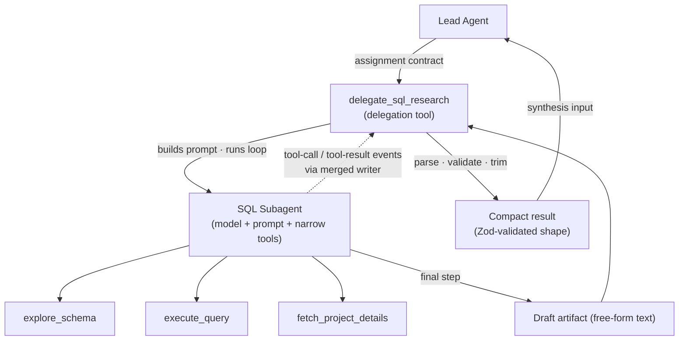

# SQL Subagent Deep Dive

## Overview

The NATP turn needs data from three sources. Two of them — SharePoint and the open web — are straightforward document searches. The third is not.

To answer *"What projects have we done with NATP in the past?"*, the system has to query the firm's project database. That database has tables it has never seen described in the prompt, columns with non-obvious names, a client that might be stored as `National Association of Tax Professionals` or `NATP` or neither, and joins between projects, clients, and team assignments. A single SQL query will not get it right. The work requires **schema exploration, failed queries, retries, and enrichment calls** — roughly eight tool calls before the data is clean enough to hand back.

That shape — iterative, domain-bounded, tool-heavy — is exactly what a **subagent** is for. This chapter walks through the NATP **SQL subagent** end to end: why it exists, how it is wired, what the eight-call trace looks like, how it recovers from empty results, and how the delegation layer sanitizes the **draft artifact** into something the Lead Agent can trust.

> **Vocabulary for .NET readers**
>
> - A **tool** is a typed function the model can call. The runtime parses the function's argument schema, exposes it to the LLM, and captures the return value as structured data. Tools are how an LLM interacts with external systems.
> - A **tool loop** is what happens when an agent calls a tool, reads the result, and decides whether to call another. Think of it as the model iterating through a plan until it is done.
> - A **subagent** is a second LLM loop nested inside a parent agent's tool call. The parent delegates an assignment; the subagent runs its own loop with its own prompt, tools, and stop conditions, and returns a compact result.
> - **Zod** is a TypeScript schema validation library (conceptually similar to DataAnnotations + FluentValidation in .NET). It defines an object shape once and gives you both a runtime validator and a static TypeScript type.

## Why Delegate SQL

Three conditions make a task right for subagent delegation:

1. **It needs iterative tool use.** One tool call is not enough. The agent has to inspect, try, react, and try again.
2. **It has a clear domain boundary.** The task lives inside one system — a database, a document store, a third-party API — and does not need to reach across.
3. **The Lead Agent should stay focused on synthesis.** Making the Lead Agent manage schema discovery, retry logic, and join construction fills its context window with low-value trace data and hurts the final answer.

The NATP SQL lookup hits all three. The database has dozens of tables and the Lead Agent does not need to learn any of them. Schema exploration can take three or four calls on its own. Retries on an empty result are normal, not exceptional.

The inverse also matters. **Do not** delegate when one deterministic call is enough. If the Lead Agent already has `client_id=4823` and just needs to fetch the project list, a direct tool call is cheaper, faster, and easier to reason about. Delegation adds a second LLM invocation, a second system prompt, a second stop condition, and a second failure mode. It earns its place only when the delegated worker needs room to iterate.

```
Good candidates for a subagent:                 Bad candidates:
  ─ SQL across unknown schema                     ─ Fetch one project by known ID
  ─ SharePoint search + doc read loop             ─ Format a date for display
  ─ Web research with query rewrites              ─ Convert a currency
  ─ PDF extraction with fallback strategies       ─ Look up a feature flag
```

## Two-Layer Architecture

The SQL subagent is not one component — it is two. The Lead Agent never talks to the subagent directly. It calls a **delegation tool** that owns the lifecycle of the subagent below it.



Three things to notice:

- **The wrapper is the contract boundary.** It defines what goes in (an assignment) and what comes out (a validated, compact result). The Lead Agent sees only the contract.
- **The subagent runs its own loop.** Its tool calls, retries, and reasoning stay inside the wrapper. Those events surface on the parent stream as sideband progress but never enter the Lead Agent's context window.
- **The draft and the compact result are different things.** The subagent produces free-form text as its final output. The wrapper turns that text into a structured object before the Lead Agent ever sees it. → See the sanitization section below.

## The Assignment Contract

When the Lead Agent decides to delegate, it passes a small typed payload called the **assignment contract** into the wrapper tool. This payload is not the whole conversation — it is a scoped instruction for one lane of work.

```typescript
// app/agents/sql/types.ts
import { z } from "zod";

export const SqlAssignmentSchema = z.object({
  taskType: z.literal("research"),            // reserved for future task variants
  sourceId: z.literal("projects-db"),         // which database to query
  sourceLabel: z.string(),                    // human-readable label for UI + trace
  instructions: z.string(),                   // what to find, in plain English
  hints: z
    .object({
      entityCandidates: z.array(z.string()),  // candidate spellings the Lead Agent already resolved
    })
    .optional(),
});

export type SqlAssignment = z.infer<typeof SqlAssignmentSchema>;
```

For the NATP turn, the Lead Agent hands the wrapper this payload:

```json
{
  "taskType": "research",
  "sourceId": "projects-db",
  "sourceLabel": "Project DB",
  "instructions": "Find past engagements with NATP (National Association of Tax Professionals). Return project names, dates, and team assignments.",
  "hints": {
    "entityCandidates": ["NATP", "National Association of Tax Professionals"]
  }
}
```

A narrow scope is the point. The subagent is not told about SharePoint, web research, the user's job title, or the rest of the conversation. It is told: *find engagements with these candidate names, in this database, and return these fields.* That constraint is what lets the subagent finish in a reasonable number of steps.

A wider scope — "answer whatever the user asked, using the database if useful" — tends to produce a subagent that drifts into orchestration: it starts asking itself whether it needs the web too, whether it should rewrite the question, whether the user's phrasing is ambiguous. That is the Lead Agent's job, not the subagent's.

## Narrow Tool Ownership

The most consequential design choice for a subagent is **narrow tool ownership** — the toolset it receives at runtime. The NATP SQL subagent gets exactly three tools:

```
SQL Subagent toolset:
  ├── explore_schema          — list tables, describe columns
  ├── execute_query           — run a read-only SELECT
  └── fetch_project_details   — enrich a project row with team assignments
```

No web search. No SharePoint. No delegation of its own. No general-purpose LLM calls. If a tool is not on the list, the model cannot call it — the runtime rejects the call before it reaches any external system.

Narrow toolsets converge faster because they leave fewer branches to explore. With a kitchen-sink registry, the model can rationalize almost any action: *"maybe the web has the answer," "maybe I should summarize first," "maybe there is a different table in a different system."* Each dead end costs tokens, latency, and a step from the budget. With three tools, the next move is usually obvious.

```
Wide toolset (drifts):                 Narrow toolset (converges):
  ┌──────────────────────┐             ┌──────────────────────┐
  │ web_search           │             │ explore_schema       │
  │ sharepoint_search    │             │ execute_query        │
  │ execute_query        │             │ fetch_project_details│
  │ read_document        │             └──────────────────────┘
  │ explore_schema       │             → model picks from 3 options
  │ fetch_project_details│             → moves toward data immediately
  │ summarize            │             → converges in ~8 steps
  │ delegate_research    │
  └──────────────────────┘
  → model picks from 8+ options
  → rationalizes side quests
  → may never reach the DB
```

## The Eight-Call Walk-Through

Here is the full trace hierarchy when the NATP SQL subagent runs. Each row is one tool call inside span `sql-1`, under parent trace `tr_7x2mn1`.

```
Root trace: "NATP projects query"                                 tr_7x2mn1   12.3s
  └── Lead Agent                                                               2.1s
       └── delegate_sql_research (tool call)
            └── SQL Subagent                                          sql-1    6.1s
                 ├── [1] explore_schema                                          48ms
                 │        → returns: clients, projects, project_assignments, employees
                 ├── [2] execute_query                                          210ms
                 │        SELECT * FROM projects WHERE client LIKE '%NATP%'
                 │        → 0 rows  (column is client_id, not client)
                 ├── [3] explore_schema(table="clients")                         39ms
                 │        → columns: id, name, industry, created_at
                 ├── [4] execute_query                                          189ms
                 │        SELECT id FROM clients WHERE name ILIKE '%national%tax%'
                 │        → 1 row: client_id=4823
                 ├── [5] execute_query                                          155ms
                 │        SELECT * FROM projects WHERE client_id=4823
                 │        → 2 rows: project_id 9012, 9341
                 ├── [6] execute_query                                          420ms
                 │        SELECT p.id, p.name, p.start_date, p.end_date
                 │        FROM projects p WHERE p.client_id=4823
                 │        → 2 rows with clean columns
                 ├── [7] fetch_project_details(projectId=9012)                  340ms
                 │        → team: 4 members, role assignments, dates
                 └── [8] fetch_project_details(projectId=9341)                  315ms
                          → team: 3 members, role assignments, dates

            → final step: subagent writes draft text listing projects + teams
            → wrapper parses draft, validates against SqlResearchResultSchema
            → compact result returned to Lead Agent
```

Each step happens for a reason:

- **[1] explore_schema** — the subagent has no prior knowledge of this database. The prompt tells it to start here.
- **[2] execute_query (first attempt)** — a reasonable guess using the word "NATP" and a `client` column. Zero rows, because the real column is `client_id`.
- **[3] explore_schema (clients table)** — instead of guessing again, the subagent inspects the `clients` table to find the right shape.
- **[4] execute_query** — resolves the entity to `client_id=4823`. This is the kind of join-key lookup the Lead Agent's hints can help with but cannot replace.
- **[5] execute_query** — the corrected query. Two rows.
- **[6] execute_query** — same query, cleaner columns. The subagent is about to build the answer and wants clean data.
- **[7], [8] fetch_project_details** — enrich each project with team assignments. This is a direct tool, not a SQL call, because the API already exposes a clean enrichment endpoint.

Eight calls. Six of them are inside the database, two are enrichment, and the whole branch finishes in about six seconds.

## Recovery From Common Failures

Three failure patterns show up in almost every SQL subagent run. All three are **in-loop recoveries** — the subagent handles them itself without terminating. That is different from a partial-salvage outcome, which is what happens when the whole loop fails and the wrapper returns a gap to the Lead Agent. → See [10 - Error Handling & Limits](./10-error-handling-and-limits.md) for the terminal case.

**Empty result.** Query ran, zero rows. The subagent treats this as *"my filter was wrong"* and either widens it (swap `LIKE` for `ILIKE`, add a second entity candidate) or re-explores the schema to find a better column. This is exactly what happens between calls 2 and 3 in the NATP trace.

**Schema mismatch.** Query returns a SQL error — unknown column, invalid join, ambiguous reference. The subagent calls `explore_schema` on the offending table and rewrites the query. The prompt explicitly tells it *"if a query fails, inspect the schema before retrying."*

**Transient error.** Connection reset, query timeout, rate limit. The subagent retries once. If the retry fails, it stops and writes a partial draft noting the failure. The wrapper reads the draft and surfaces the gap as a `partial: true` flag on the result.

```
Failure type                    In-loop response
───────────────────────────────────────────────────────────────────
empty result (0 rows)           widen filter · re-explore schema · retry
unknown column                  inspect table with explore_schema · rewrite
invalid JOIN                    inspect related tables · rewrite
transient connection error      one retry · then draft with partial flag
timeout on a single query       skip to next step · note in draft
hard stop (step budget hit)     write best-effort draft · wrapper marks partial
```

## Subagent Prompt Shape

The subagent's system prompt is short and task-focused. It does five things and nothing else:

1. Declares the subagent's role.
2. Names the source it is querying and why it exists.
3. Injects the assignment and any hints.
4. Gives tool guidance — which tool to call when, with a bias toward the first move.
5. States the convergence rule — when to stop and what the draft must contain.

```typescript
// app/agents/sql/buildSqlSubagentPrompt.ts
export function buildSqlSubagentPrompt(args: {
  assignment: SqlAssignment;
  schemaOverview: string;   // a high-level table list, not the full DDL
}): string {
  const { assignment, schemaOverview } = args;

  return `You are a SQL research subagent. Your only job is to answer one database question and return a compact draft.

## Source
${assignment.sourceLabel} (${assignment.sourceId})

## Assignment
${assignment.instructions}

${assignment.hints?.entityCandidates?.length
    ? `Candidate entity names the lead agent already resolved:\n${assignment.hints.entityCandidates.map((n) => `- ${n}`).join("\n")}`
    : ""}

## Tools
- explore_schema(table?)   — start here; map the tables you will need
- execute_query(sql)       — read-only SELECT; inspect the schema if a query fails
- fetch_project_details(projectId) — use for enrichment once you have project IDs

## Convergence
- Stop when you have named projects with dates and team assignments.
- Write a short plain-text draft. Do not wrap it in JSON.
- If a step fails in a way you cannot recover from, write the draft anyway and note the gap.

## Database overview
${schemaOverview}
`;
}
```

A few deliberate choices worth calling out:

- **No verbose role-play.** The subagent is not "an expert analyst who takes pride in their work." It is a task-runner with a convergence rule.
- **First-move bias.** The prompt tells it to start with `explore_schema`. Without that nudge, models often try a speculative query first and burn a step.
- **Draft, not JSON.** The subagent is asked for plain text. Structuring happens in the wrapper, not inside the model's tool loop — models are worse at producing strict JSON under pressure than at producing prose that the wrapper can parse.

## Bounded Stop

Every subagent needs a **hard step budget**. The NATP SQL subagent uses `stepCountIs(12)` — a step here is one iteration of the tool loop (tool call + tool result, or a final text step). The expected run is eight calls; the budget is twelve so there is room for two synthesis steps and two extra exploration calls without hitting the ceiling.

```typescript
// app/agents/sql/sqlSubagent.server.ts
import { stepCountIs, streamText } from "ai";
import { z } from "zod";

export function createSqlSubagent(config: {
  model: LanguageModel;
  assignment: SqlAssignment;
  schemaOverview: string;
  getSchema: (table?: string) => Promise<SchemaInfo>;
  runQuery: (sql: string) => Promise<QueryResult>;
  getProjectDetails: (projectId: number) => Promise<ProjectDetails>;
}) {
  // Narrow tool ownership — three tools only, nothing else in scope.
  const tools = {
    explore_schema: tool({
      description: "List tables or describe columns for one table.",
      inputSchema: z.object({ table: z.string().optional() }),
      execute: async ({ table }) => config.getSchema(table),
    }),
    execute_query: tool({
      description: "Run a read-only SELECT against the projects database.",
      inputSchema: z.object({ sql: z.string() }),
      execute: async ({ sql }) => config.runQuery(sql),
    }),
    fetch_project_details: tool({
      description: "Enrich a project with its team assignments.",
      inputSchema: z.object({ projectId: z.number() }),
      execute: async ({ projectId }) => config.getProjectDetails(projectId),
    }),
  };

  return {
    stream: () =>
      streamText({
        model: config.model,
        system: buildSqlSubagentPrompt({
          assignment: config.assignment,
          schemaOverview: config.schemaOverview,
        }),
        tools,
        // Hard ceiling — expected run is ~8 steps, 12 leaves room
        // for synthesis and one retry without runaway behavior.
        stopWhen: [stepCountIs(12)],
        experimental_telemetry: {
          isEnabled: true,
          functionId: "sqlSubagent",   // becomes the span name in the trace
        },
      }),
  };
}
```

The Lead Agent's step budget is larger — it has to delegate, wait, and synthesize across three parallel branches — but each subagent is capped tighter. That asymmetry is intentional. A runaway subagent should cost at most twelve calls, not the whole turn.

## Sanitize and Structure in the Wrapper

The subagent's final output is free-form text. The Lead Agent cannot consume free-form text — it needs a stable object shape it can read fields off of. **Sanitization** happens in the wrapper, not in the subagent.

```typescript
// app/agents/sql/schemas.ts
import { z } from "zod";

export const SqlResearchResultSchema = z.object({
  projects: z.array(
    z.object({
      id: z.number(),
      name: z.string(),
      client: z.string(),
      startDate: z.string(),                    // ISO date
      endDate: z.string().nullable(),           // null for ongoing
      team: z.array(
        z.object({
          employeeId: z.number(),
          name: z.string(),
          role: z.string(),
        })
      ),
    })
  ),
  citations: z.array(
    z.object({
      kind: z.literal("sql"),
      query: z.string(),
      rowCount: z.number(),
    })
  ),
  partial: z.boolean().optional(),              // true if the loop ended early
});

export type SqlResearchResult = z.infer<typeof SqlResearchResultSchema>;
```

The wrapper reads the draft, attempts to parse it deterministically, and falls back to a structuring pass if the deterministic parse misses:

```typescript
// app/agents/lead/tools/delegateSqlResearch.ts
import { tool, generateObject } from "ai";
import { handleSubAgentStream } from "~/toolkit/ai/subagentDataWriter";
import { modelRegistry } from "~/toolkit/ai/llm/modelRegistry";
import { SqlAssignmentSchema, type SqlAssignment } from "~/agents/sql/types";
import { SqlResearchResultSchema, type SqlResearchResult } from "~/agents/sql/schemas";
import { createSqlSubagent } from "~/agents/sql/sqlSubagent.server";

export const createSqlResearchTool = (options: {
  writer?: UIMessageStreamWriter<UIMessage>;
}) =>
  tool({
    description: "Delegate a database research task to the SQL subagent.",
    inputSchema: SqlAssignmentSchema,
    execute: async (assignment: SqlAssignment, ctx) => {
      const subagent = createSqlSubagent({
        // Cheaper model than the lead — SQL is narrow, reasoning is shallow
        model: modelRegistry.languageModel("default:sqlSubagent"),
        assignment,
        schemaOverview: await loadSchemaOverview(),
        getSchema: exploreSchema,
        runQuery: runReadOnlyQuery,
        getProjectDetails: fetchProjectDetails,
      });

      const streamResult = subagent.stream();

      // Merge subagent events into the parent stream.
      // sql_ prefix on tool-call IDs prevents collisions with sp-1 and web-1.
      if (options.writer) {
        await handleSubAgentStream(streamResult, {
          writer: options.writer,
          name: assignment.sourceLabel,
          parentToolCallId: ctx.toolCallId,
        });
      }

      // Draft is free-form text; parse + validate before returning.
      const draft = await streamResult.text;
      return sanitizeAndStructure(draft, assignment);
    },
  });

async function sanitizeAndStructure(
  draft: string,
  assignment: SqlAssignment
): Promise<SqlResearchResult> {
  // First try: deterministic parse if the subagent emitted clean markdown.
  const deterministic = tryParseStructured(draft);
  if (deterministic.success) return deterministic.data;

  // Fall back to a cheap structuring pass — a small model coerces the
  // draft into the target schema. Not reasoning, just shape transformation.
  const { object } = await generateObject({
    model: modelRegistry.languageModel("default:fast"),
    schema: SqlResearchResultSchema,
    system:
      "Convert this SQL research draft into the target schema. " +
      "Use only facts from the draft — do not invent values. " +
      "Set partial=true if the draft notes any gaps.",
    prompt: `<assignment>${assignment.instructions}</assignment>\n\n<draft>\n${draft}\n</draft>`,
  });

  return object;
}
```

Only the structured shape reaches the Lead Agent. If the draft mentions four projects but the parse finds three, the Lead Agent sees three. If the subagent wrote `"⚠ SharePoint unavailable, skipped"` into its draft, the wrapper sets `partial: true` and the Lead Agent knows to acknowledge the gap.

This boundary matters because model output is not consistently shaped. Without the sanitization step, a single malformed draft corrupts the Lead Agent's synthesis. With it, the Lead Agent sees one contract every time.

## Streaming Behavior

The subagent does not produce an isolated stream. It writes into the same SSE connection the API Layer opened at the start of the turn. That happens because the **writer** is threaded down through the Lead Agent, into the delegation wrapper, and into the subagent's `handleSubAgentStream` call. → See [02 - Request Flow & Streaming](./02-request-flow-and-streaming.md) for the writer-propagation pattern.

Three things show up on the parent SSE stream while `sql-1` is running:

- A `data` event announcing `sql-1` as `starting`.
- A series of `tool-call` / `tool-result` pairs — one per call in the eight-step walk-through. Each one carries a `toolCallId` with the `sql_` prefix added by `writer.merge`, so it never collides with the SharePoint or web subagents running in parallel.
- A `data` event announcing `sql-1` as `completed` (or `partial` / `error` if the loop did not finish cleanly).

```
{"type":"data","data":{"type":"subagent","id":"sql-1","status":"starting"}}
{"type":"tool-call","toolCallId":"sql_tc_0","toolName":"explore_schema","args":{}}
{"type":"tool-result","toolCallId":"sql_tc_0","result":{"tables":[...]}}
{"type":"tool-call","toolCallId":"sql_tc_1","toolName":"execute_query","args":{"sql":"..."}}
{"type":"tool-result","toolCallId":"sql_tc_1","result":{"rows":[],"rowCount":0}}
...
{"type":"data","data":{"type":"subagent","id":"sql-1","status":"completed"}}
```

The UI uses the `data` events to build the progress card for the SQL subagent, and the `tool-call` / `tool-result` pairs populate the collapsible list inside that card. The Lead Agent's text synthesis at the end of the turn never has to mention any of this — the tool activity is already visible to the user.

## Model Tier

The SQL subagent runs on a **cheaper, narrower model** than the Lead Agent. The Lead Agent needs strong reasoning to synthesize across three sources; the SQL subagent needs to follow a structured loop and write SQL. Those are different skills, and paying for frontier reasoning on every tool call adds up fast.

The model registry exposes a named alias — `default:sqlSubagent` — that points to the cheaper model. Swapping tiers is a one-line config change, not a code edit. → See [11 - Model Selection & Registry](./11-model-selection-and-registry.md) for the registry pattern and the full set of aliases.

## When to Add More Subagents of This Shape

The SQL subagent is one instance of a repeatable pattern. Any source with a bounded toolset and an iterative loop is a candidate:

- **SharePoint subagent** — search the Graph API, read a doc, extract key fields. Narrow toolset: `graph_search`, `read_document`. Same wrapper-plus-subagent shape.
- **Web research subagent** — query a search provider, read a page, summarize. Narrow toolset: `web_search`, `read_page`.
- **Any future source** — a CRM, an internal knowledge base, a filings archive. Same shape.

Each new subagent adds one more delegation tool to the Lead Agent's registry. The Lead Agent decides which to call; the subagent owns the loop inside its lane. The architecture scales by addition, not by coupling.

## Key Takeaways

- Delegate SQL when the task needs iterative tool use, has a clear domain boundary, and would otherwise bloat the Lead Agent's context with schema trace data.
- The pattern is two layers: a delegation tool owned by the Lead Agent, and a subagent with its own prompt, narrow toolset, and step budget.
- The assignment contract keeps the subagent's scope small. A wider scope produces drift.
- Narrow tool ownership is more effective than prompt-only discipline — if a tool is not in the registry, the model cannot call it.
- The subagent produces a draft; the wrapper turns it into a Zod-validated, compact result before the Lead Agent ever sees it.
- A hard `stopWhen` budget of ~12 steps gives room for the expected eight calls plus synthesis and one retry, without runaway behavior.
- A cheaper model tier for the subagent is the right default — reserve frontier reasoning for the Lead Agent.

## Related Sections

- [01 - Architecture Overview](./01-architecture-overview.md): Where the SQL subagent sits in the overall runtime.
- [02 - Request Flow & Streaming](./02-request-flow-and-streaming.md): How the writer is threaded into the subagent and how events merge.
- [04 - Subagent Fan-Out Pattern](./04-subagent-fanout-pattern.md): Running the SQL, SharePoint, and web subagents in parallel.
- [08 - Telemetry & Tracing](./08-telemetry-and-tracing.md): How the eight-call trace hierarchy is captured under one root span.
- [10 - Error Handling & Limits](./10-error-handling-and-limits.md): Terminal failures, partial-salvage outcomes, and budget guardrails.
- [11 - Model Selection & Registry](./11-model-selection-and-registry.md): The `default:sqlSubagent` alias and cheaper-tier routing.
