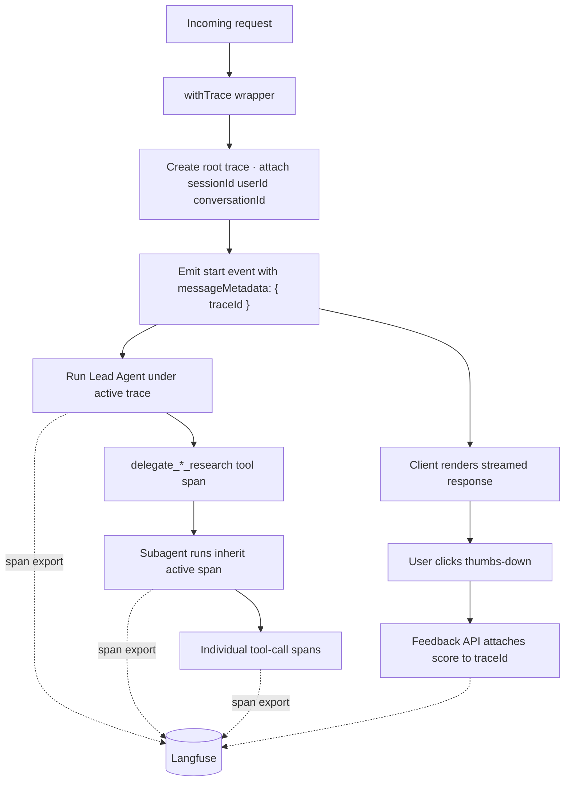

# Telemetry & Tracing

## Why Tracing Is Request Infrastructure

When the NATP turn runs, three subagents work in parallel. The SQL subagent alone makes eight tool calls. SharePoint does its own Graph API walk. Web research reads a handful of pages. Without end-to-end tracing, each of those loops looks like a separate, unrelated story in the observability backend — you get four traces, none of them linked, and no way to answer the one question that matters: *"why did this single user turn take 12.3 seconds, and which branch spent the time?"*

Treat tracing as **request infrastructure**. The root **trace** is created at the API Layer before the SSE stream opens. Every child **span** — lead-agent generations, delegation tool calls, subagent runs, individual tool invocations — is attached to that root. The `traceId` is written into the first SSE event the client sees. When the user later clicks thumbs-down on the message, the feedback API attaches a **score** to that same trace.

For a .NET reader: this is the same idea as an `Activity` hierarchy in `System.Diagnostics`, exported over OpenTelemetry. The difference is the backend. **Langfuse** is a specialized LLM observability system — similar in spirit to Application Insights, but the unit of work is a model **generation** with prompts, completions, token usage, and user scores, not an HTTP request or database call.

```
Root trace: "NATP projects query"                  12.3s
  └── Lead Agent                                    2.1s
       └── delegate_research (tool call)
            ├── SQL Subagent                        6.1s
            │    ├── explore_schema                 43ms
            │    ├── execute_query (attempt 1)      210ms  → 0 rows
            │    ├── execute_query (attempt 2)      189ms  → 2 rows
            │    └── fetch_project_details          340ms
            ├── SharePoint Subagent                 4.2s
            │    ├── graph_search                   800ms  → 3 docs
            │    └── read_document                  1.1s
            └── Web Research Subagent               3.8s
                 ├── web_search                     1.2s
                 └── read_page                      900ms
```

That tree is the object of the exercise. Everything below is how it gets built correctly.

## The Layered Stack

Four cooperating layers produce the tree above. None of them is responsible for the whole thing.

- **OpenTelemetry (OTEL)** owns the **span processor** and the raw span tree. It is the transport and the data model.
- **Langfuse** sits on top of OTEL as an LLM-aware backend. Its span processor translates OTEL spans into traces, observations, generations, and scores. The same Langfuse client also offers a direct API for submitting user feedback as scores.
- **AI SDK telemetry** (`experimental_telemetry: { isEnabled: true, functionId: "leadAgent" }`) turns each `agent.stream(...)` call into a child span automatically, with model, token usage, and finish reason recorded as generation attributes.
- **Thin wrapper helpers** — a `withTrace` wrapper at the request boundary and a `finalizeTrace` call at the end — bracket every turn with explicit start and flush.



Three things to notice:

- The trace is named **before** any model call. A pre-model validation failure still lands under `"NATP projects query"` instead of a nameless span.
- The client learns the `traceId` on millisecond one, not at the end of the turn. That identifier is what every downstream feedback or error report will key off.
- Span export is a dotted side path. The request path succeeds or fails on its own — telemetry is additive, not blocking.

## Initialize the Tracer Provider Once

The tracer provider is configured at process startup in a single instrumentation module. This module registers a Langfuse-aware **span processor** if Langfuse credentials are present, and a `NoopSpanProcessor` otherwise.

```typescript
// app/common/telemetry.server.ts
import { LangfuseSpanProcessor } from "@langfuse/otel";
import { resourceFromAttributes } from "@opentelemetry/resources";
import { NodeTracerProvider, NoopSpanProcessor } from "@opentelemetry/sdk-trace-node";
import type { ReadableSpan } from "@opentelemetry/sdk-trace-base";

function hasLangfuseConfig() {
  return Boolean(
    process.env.LANGFUSE_SECRET_KEY &&
      process.env.LANGFUSE_PUBLIC_KEY &&
      process.env.LANGFUSE_URL,
  );
}

// Only export spans produced by the AI SDK and the Langfuse SDK.
// HTTP, Redis, and framework auto-instrumentation would otherwise drown out
// agent and tool spans in the trace view.
function shouldExportSpan({ otelSpan }: { otelSpan: ReadableSpan }) {
  const scope = otelSpan.instrumentationScope?.name ?? "";
  return ["langfuse-sdk", "ai", "@ai-sdk"].some((p) => scope.startsWith(p));
}

export const spanProcessor = hasLangfuseConfig()
  ? new LangfuseSpanProcessor({
      publicKey: process.env.LANGFUSE_PUBLIC_KEY!,
      secretKey: process.env.LANGFUSE_SECRET_KEY!,
      baseUrl: process.env.LANGFUSE_URL!,
      environment: process.env.NODE_ENV,
      shouldExportSpan,
    })
  : // WHY: silent no-op beats accidentally exporting traces to a random backend
    // in local dev. Fail to nothing, not to the wrong place.
    new NoopSpanProcessor();

const provider = new NodeTracerProvider({
  resource: resourceFromAttributes({
    "service.name": "natp-multiagent",
    "service.version": process.env.BUILD_SHA ?? "local",
  }),
  spanProcessors: [spanProcessor],
});

provider.register();
```

Two decisions worth explaining.

The `NoopSpanProcessor` fallback is deliberate. If Langfuse is not configured, spans are discarded — not logged to stdout, not exported to any default collector. Shipping traces to a local backend by accident is worse than shipping nothing: an unreviewed destination becomes a compliance surprise the first time a production prompt leaks into it.

The `shouldExportSpan` allowlist is also deliberate. OTEL auto-instrumentation for HTTP, Redis, and the framework produces hundreds of spans per turn. Those spans are useful elsewhere, but in an LLM debugging UI they bury the agent and tool spans under a wall of infrastructure noise. Filtering at export time keeps the Langfuse trace tree readable.

## Bracket Every Request With `withTrace`

Trace ownership starts at the API Layer. A small wrapper creates the root trace when the request arrives, attaches session and user metadata once the request is validated, and flushes the span processor before the response finishes.

```typescript
// app/common/withTrace.server.ts
import { observe, setActiveTraceIO, updateActiveObservation } from "@langfuse/tracing";
import { trace } from "@opentelemetry/api";
import { spanProcessor } from "./telemetry.server";

export type TraceHandle = {
  traceId: string | undefined;
  setInput: (input: unknown) => void;
  setMetadata: (meta: Record<string, string>) => void;
  // Call exactly once before returning from the handler
  finalize: (output: unknown) => Promise<void>;
};

export function withTrace<TArgs, TReturn>(
  traceName: string,
  handler: (args: TArgs, t: TraceHandle) => Promise<TReturn>,
) {
  return observe(
    async (args: TArgs) => {
      // Name the trace eagerly so validation failures before the first model
      // call still land under "NATP projects query", not an anonymous span.
      trace.getActiveSpan()?.setAttribute("langfuse.trace.name", traceName);

      const handle: TraceHandle = {
        get traceId() {
          return trace.getActiveSpan()?.spanContext().traceId;
        },
        setInput(input) {
          setActiveTraceIO({ input });
          updateActiveObservation({ input });
        },
        setMetadata(meta) {
          const span = trace.getActiveSpan();
          for (const [k, v] of Object.entries(meta)) {
            span?.setAttribute(`langfuse.trace.metadata.${k}`, v);
          }
        },
        async finalize(output) {
          setActiveTraceIO({ output });
          updateActiveObservation({ output });
          trace.getActiveSpan()?.end();
          // Serverless tears the process down fast. Without this flush the
          // final spans — often the most useful ones — never reach Langfuse.
          await spanProcessor.forceFlush();
        },
      };

      return handler(args, handle);
    },
    { name: traceName, asType: "agent", endOnExit: false },
  );
}
```

At the API route, the handler wraps itself in `withTrace` and attaches the normalized request metadata once validation succeeds:

```typescript
// app/chat/routes/api.chat.ts
export const action = withTrace(
  "NATP projects query",
  async ({ request }: Route.ActionArgs, trace) => {
    const { user } = await requireAuth(request);
    const { messages, conversationId } = ChatInputSchema.parse(await request.json());

    trace.setInput(messages.at(-1));
    trace.setMetadata({
      conversationId,
      userId: user.id,
      model: "default:leadAgent",
    });

    const stream = createUIMessageStream({
      execute: ({ writer }) => {
        const agent = createLeadAgent({ writer });
        writer.merge(
          agent.stream({ messages: convertToModelMessages(messages) }).toUIMessageStream({
            sendStart: false,
            sendFinish: false,
            messageMetadata: ({ part }) => {
              // Client sees traceId on the very first event of the turn.
              if (part.type === "start") return { traceId: trace.traceId };
            },
            onFinish: async ({ messages: finalMessages }) => {
              await saveConversation({ id: conversationId, messages: finalMessages });
              await trace.finalize(finalMessages.at(-1));
            },
          }),
        );
      },
    });

    return createUIMessageStreamResponse({ stream });
  },
);
```

Why not defer trace creation until the model call starts? Because a surprising share of failures happen before the first token: malformed message state, auth failures, quota checks, an upstream runtime being unavailable, a cancellation race. If tracing begins only inside the lead agent, those exits vanish from the observability model. Name the trace eagerly and those failed turns still show up under the NATP trace name — easy to filter and audit.

## Propagate Trace Context Into Subagents

The AI SDK's `experimental_telemetry` hook makes each `agent.stream(...)` call a child span of whatever OTEL span is currently active. That is the mechanism that glues the whole tree together — there is no manual span plumbing. The lead agent, the delegation tool span, and each subagent all nest automatically because each runs inside the previous one's active context.

```typescript
// app/agents/lead/leadAgent.server.ts
export function createLeadAgent(config: { writer?: UIMessageStreamWriter<UIMessage> }) {
  return new Agent({
    model: modelRegistry.languageModel("default:leadAgent"),
    system: leadAgentSystemPrompt,
    tools: {
      delegate_sql_research: createSqlResearchTool({ writer: config.writer }),
      delegate_sharepoint_research: createSharePointResearchTool({ writer: config.writer }),
      delegate_web_research: createWebResearchTool({ writer: config.writer }),
    },
    // Each lead-agent run becomes one child span under the root trace.
    experimental_telemetry: {
      isEnabled: true,
      functionId: "leadAgent",
    },
    /* ... */
  });
}
```

Inside a delegation tool, the subagent's own `stream(...)` call is made while the tool span is active. Forwarding `experimental_telemetry` is all that is needed — the span nests under the tool span, which nests under the lead agent, which nests under the root trace.

```typescript
// app/agents/lead/tools/delegateSqlResearch.ts
export const createSqlResearchTool = (options: { writer?: UIMessageStreamWriter<UIMessage> }) =>
  tool({
    description: "Query the project database for past NATP engagements.",
    inputSchema: z.object({ query: z.string() }),
    execute: async ({ query }, ctx) => {
      const agent = createSqlSubagent();
      const result = agent.stream({
        messages: [{ role: "user", content: query }],
        experimental_telemetry: {
          isEnabled: true,
          // functionId differentiates the three subagent spans in Langfuse.
          functionId: "sqlSubagent",
          // Per-span metadata — inputs that help triage a slow branch later.
          metadata: { parentToolCallId: ctx.toolCallId, subagentId: "sql-1" },
        },
      });

      if (options.writer) {
        await handleSubAgentStream(result, { /* ... */ });
      }
      return { status: "completed", findings: await result.steps };
    },
  });
```

The resulting nesting matches the ASCII tree at the top of this chapter. The eight `execute_query` / `explore_schema` calls inside the SQL subagent appear automatically as child spans because each tool execution runs inside the subagent's active span.

### What belongs at which level

Attach metadata where the data lives. Do not copy everything everywhere.

- **At the root trace** — `sessionId`, `userId`, `conversationId`, the initial user prompt, the model name, and any feature flags or correlation identifiers. Attached once, in `withTrace`.
- **At each generation** — inputs, outputs, model, token usage, finish reason. The AI SDK records these automatically when `experimental_telemetry` is enabled.
- **At each span** — tool name, tool inputs (optionally redacted), output size, status. The AI SDK attaches these from the tool registry; you rarely need to add more.

Keep propagated metadata small and serializable. Rich objects belong on the trace. A handful of string identifiers is all the execution context needs to carry.

## The `start` Event Carries `traceId` to the Client

Look at the first event the client sees during the NATP turn:

```
{"type":"start","messageId":"msg_0j3kp9","messageMetadata":{"traceId":"tr_7x2mn1"}}
```

That is the whole linkage. The `traceId` lands on millisecond one, before any text-delta, before any tool-call. The UI renders a Feedback button wired to that trace ID immediately. If the run fails mid-stream, the client still has the trace ID and can surface a "view trace" affordance in the error banner.

If the `traceId` were only emitted at finish, three things break:

- Cancelled runs lose their trace linkage entirely.
- Feedback on a partial answer cannot target the right trace.
- Error banners have no trace to link to — you are back to asking the user for a timestamp and grep'ing logs.

Inside the API Layer code, the mechanism is a single line on the outer stream:

```typescript
// app/chat/routes/api.chat.ts
.toUIMessageStream({
  sendStart: false,   // API layer will emit start with traceId (below)
  messageMetadata: ({ part }) => {
    if (part.type === "start") return { traceId: trace.traceId };
  },
  /* ... */
})
```

The `sendStart: false` / explicit start pair is what the architecture overview and streaming chapters call the "one owner for start/finish" rule. That same rule is what makes `traceId` injection safe: there is exactly one `start` event per turn, so there is exactly one place to attach the trace.

## Reading the NATP Trace in Practice

Open the root trace labeled `"NATP projects query"`. You see one row: `tr_7x2mn1`, total duration 12.3s.

Drill in. The immediate child is **Lead Agent** — the first generation — 2.1s. Its output is the set of three parallel tool calls and the final synthesized answer. Under Lead Agent you see three tool spans: `delegate_sql_research`, `delegate_sharepoint_research`, `delegate_web_research`. Each one wraps an entire subagent run.

Open `delegate_sql_research`. The child span is `sqlSubagent`, 6.1s. Under it: eight further spans, each a single tool call — `explore_schema`, two attempts at `execute_query`, a `fetch_project_details`. Each has latency on the left and, in the attributes panel, the input query and output row count. The second `execute_query` returned 2 rows; the first returned 0. That is the story of the NATP SQL branch, readable in ten seconds.

```
Root trace: "NATP projects query"                  12.3s
  └── Lead Agent                                    2.1s
       └── delegate_research (tool call)
            ├── SQL Subagent                        6.1s
            │    ├── explore_schema                 43ms
            │    ├── execute_query (attempt 1)      210ms  → 0 rows
            │    ├── execute_query (attempt 2)      189ms  → 2 rows
            │    └── fetch_project_details          340ms
            ├── SharePoint Subagent                 4.2s
            │    ├── graph_search                   800ms  → 3 docs
            │    └── read_document                  1.1s
            └── Web Research Subagent               3.8s
                 ├── web_search                     1.2s
                 └── read_page                      900ms
```

The SharePoint and Web branches read the same way. That is the point: three different data sources, three different iteration patterns, one unified view.

## Failure Attribution

The partial-failure case is where this architecture earns its keep. When the SharePoint Graph API times out mid-turn:

- `delegate_sharepoint_research` still closes cleanly — the delegation tool catches the timeout and returns a structured `{status: "partial"}` result (see [02 - Request Flow & Streaming](./02-request-flow-and-streaming.md)).
- The span records `status: "partial"` as an attribute. In Langfuse you can filter across every trace with `metadata.status = "partial"` to find each time this has happened.
- The underlying HTTP error shows up as an error span under `sp-1`. Drilling in shows the exact Graph API response.
- The other two subagent branches continue. Lead Agent synthesizes a final answer that acknowledges the SharePoint gap explicitly.

In the trace tree, the shape of failure is obvious at a glance — one branch shorter than the others, marked partial. In logs alone that shape is nearly impossible to recover.

## Close the Loop With Feedback

The last link in the chain is user feedback. The message bubble renders a thumbs-up / thumbs-down pair wired to the `traceId` that arrived in the `start` event. When the user clicks, the client POSTs to `/api/feedback` with `{ traceId, messageId, score, comment }`. The server turns that into a Langfuse **score** attached to the same trace.

```
UI thumbs-down
     │
     ▼
POST /api/feedback { traceId: "tr_7x2mn1", messageId: "msg_0j3kp9",
                    score: 0, comment: "missed the pre-sales folder" }
     │
     ▼
server: langfuse.score({ traceId: "tr_7x2mn1", name: "user_feedback",
                         value: 0, comment: "..." })
     │
     ▼
Langfuse trace "NATP projects query" (tr_7x2mn1)
  └── score: user_feedback = 0 ("missed the pre-sales folder")
```

The mechanics are intentionally boring:

```typescript
// app/chat/routes/api.feedback.ts
export const action = async ({ request }: Route.ActionArgs) => {
  const { user } = await requireAuth(request);
  const { traceId, messageId, score, comment } = FeedbackSchema.parse(
    await request.json(),
  );

  await langfuse.score({
    traceId,          // Same ID the client received in the start event
    name: "user_feedback",
    value: score,     // 0 or 1
    comment,
    // Optional: bind to an observation so the score targets the assistant
    // message span specifically rather than the whole turn.
    observationId: messageId,
  });

  return new Response(null, { status: 204 });
};
```

The crucial property: no timestamp matching, no reconstruction, no "probably this trace." The `traceId` travels through the UI exactly once, and the feedback chain stays intact regardless of how the turn ended.

## Flushing Is Not Optional

Streaming and serverless runtimes share a hazard: the process can be torn down almost immediately after the HTTP response finishes. Spans buffered in the exporter never leave the box. The traces that arrive are missing the most useful tail — final outputs, completion metadata, scores.

The fix is one line in `finalize`:

```typescript
// app/common/withTrace.server.ts
async finalize(output) {
  setActiveTraceIO({ output });
  updateActiveObservation({ output });
  trace.getActiveSpan()?.end();
  // Without this, serverless teardown beats the exporter to the punch and
  // partial traces are what you see in Langfuse.
  await spanProcessor.forceFlush();
},
```

If traces ever look systematically truncated — missing outputs, missing finish reason, absent on fast failures — the first place to check is whether the span processor is flushed on every exit path, including the error path.

## Key Takeaways

- Trace ownership starts at the API Layer. Create the root trace and name it eagerly so pre-model failures still appear under a meaningful name.
- The `traceId` lives in the first SSE `start` event. That is what makes feedback, error banners, and cancelled runs traceable.
- AI SDK `experimental_telemetry` propagates trace context across agent and subagent boundaries automatically — no manual span plumbing.
- Langfuse's span processor sits on top of OTEL. Use a `NoopSpanProcessor` fallback so unconfigured environments ship nothing, not the wrong thing.
- Filter exported spans to AI-related scopes. Infrastructure spans bury the agent tree.
- Flush the span processor in `finalize`. Serverless teardown is faster than exporter buffers.
- Partial subagent failures show up as `status: "partial"` attributes on the delegation tool span, making them filterable in Langfuse.
- User feedback closes the loop by attaching a score to the same `traceId` the client received at stream start.

## Related Sections

- [01 - Architecture Overview](./01-architecture-overview.md): Where the root trace fits in the overall runtime layer diagram.
- [02 - Request Flow & Streaming](./02-request-flow-and-streaming.md): Why the `start` event is the only safe place to inject `traceId`.
- [04 - Subagent Fan-Out Pattern](./04-subagent-fanout-pattern.md): How delegation tools wrap subagent spans and own partial-success attribution.
- [07 - Specialized Execution Subagent](./07-sql-subagent-deep-dive.md): The SQL branch that produces the eight child spans shown in the trace tree.
- [09 - Conversation Persistence](./09-conversation-persistence.md): How the `traceId` is persisted with the final UIMessage for later lookup.
- [10 - Error Handling & Limits](./10-error-handling-and-limits.md): Error classification that the trace's `status` attribute reflects.
