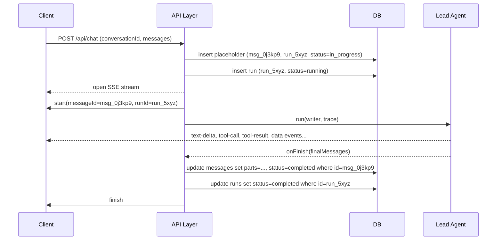
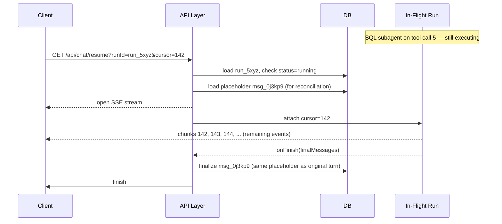

# Conversation Persistence

## Overview

When the NATP turn runs, three subagents fan out, roughly fifteen tool calls fire across them, and the client sees an ordered stream of events. That stream is ephemeral. It exists for the duration of one HTTP connection. Close the tab, lose Wi-Fi, or kill the worker process halfway through, and the stream is gone.

What survives is the **server transcript** — the database record of what the conversation actually contained. Persistence is what turns a transient stream into a durable, reloadable conversation, and what lets a user refresh the page at tool call five and see the rest of the answer arrive as if nothing happened.

This chapter covers the invariants that make that work: server-authoritative storage, stable IDs, a separate run-state table, the **placeholder** pattern that anchors a turn before any model output exists, the **sweeper** that repairs crashed runs, and the **resumable stream cursor** that lets a refresh reattach to an in-flight turn.

For .NET readers: Postgres with JSONB columns behaves like SQL Server with a typed JSON column — indexable, queryable, and well-suited for storing structured message payloads. A **UIMessage** is the rich, UI-shaped message record (with parts, tool activity, metadata). A **ModelMessage** is the lean shape the model runtime actually sees. SSE (Server-Sent Events) is the one-way HTTP streaming transport the client uses to read events as they arrive.

## The Server Transcript Is Authoritative

The database is the source of truth. The client's rendered state — the assistant message bubble, the progress cards, the partial text — is provisional. It reflects what the current tab has seen over the current SSE connection. A refresh, a second tab, or a retry has to reconcile against the server record, not against local state.

This rule decides a lot of downstream design:

- **Browser refresh mid-turn.** The new page load fetches the persisted transcript from the server, then asks whether there's an in-flight run it can reattach to. Local component state from the prior page is thrown away.
- **Multiple tabs open on the same conversation.** Each tab hydrates from the server on mount and on visibility change. Tabs do not broadcast transcript state to each other directly.
- **Retry of a failed turn.** The retry reads the last durable server state, not the half-rendered DOM of the failed attempt.
- **The sweeper repairs stuck rows in the DB.** Client-side logic cannot do this reliably because the client may not be connected when the stuck row needs repair.

If the client disagrees with the server, the server wins. Every time.

## Stable IDs at Three Levels

The NATP turn carries three identifiers that persist across reconnects, retries, and background repair:

- `conversationId` — `conv_0ab1c2`. One per conversation. Stays put for the life of the chat thread.
- `runId` — `run_5xyz`. One per assistant turn. A new run is created every time the user submits a prompt.
- `messageId` — `msg_0j3kp9`. One per persisted message row. The assistant message for `run_5xyz` gets exactly one `messageId`, and that ID is how every subsequent write — streaming chunks, final save, sweeper repair — finds the right row.

```
conv_0ab1c2 (conversation)
    ├── msg_u7...  role=user         "I just had a call with NATP..."
    └── msg_0j3kp9 role=assistant    runId=run_5xyz, status=in_progress → completed
```

Never identify the active assistant message by array position. Position is unstable under retries, concurrent tabs, and repair writes. The `messageId` is stable. Use it.

The `runId` is emitted in the `start` SSE event alongside the `messageId` so the client can key its UI reducer on the real identifier from the first chunk:

```json
{"type":"start","messageId":"msg_0j3kp9","messageMetadata":{"runId":"run_5xyz","traceId":"tr_7x2mn1"}}
```

## Transcript State vs. Run State

Two tables, two lifetimes.

**Transcript state** is the durable conversation history. User messages, assistant messages, the tool parts and text parts that make up each assistant response. It lives forever (or until the user deletes the conversation). It's what loads when the page opens.

**Run state** is the ephemeral execution status of the current turn. Is a run active? What phase is it in — bootstrapping, answering, tooling, finalizing? When was the last chunk written? What was the terminal status? It's short-lived and churns fast.

```sql
-- Transcript: durable, user-visible
CREATE TABLE messages (
  id              TEXT PRIMARY KEY,                  -- msg_0j3kp9
  conversation_id TEXT NOT NULL REFERENCES conversations(id),
  role            TEXT NOT NULL,                     -- 'user' | 'assistant'
  parts           JSONB NOT NULL DEFAULT '[]',       -- UIMessage parts
  metadata        JSONB NOT NULL DEFAULT '{}',       -- runId, traceId, errorMessage
  status          TEXT NOT NULL DEFAULT 'completed', -- in_progress | completed | failed | cancelled
  created_at      TIMESTAMPTZ NOT NULL DEFAULT NOW()
);

-- Run state: ephemeral, execution-facing
CREATE TABLE runs (
  id              TEXT PRIMARY KEY,                  -- run_5xyz
  conversation_id TEXT NOT NULL REFERENCES conversations(id),
  status          TEXT NOT NULL,                     -- running | completed | failed | cancelled
  stream_cursor   INTEGER NOT NULL DEFAULT 0,        -- chunk index for resume
  started_at      TIMESTAMPTZ NOT NULL DEFAULT NOW(),
  finished_at     TIMESTAMPTZ
);
```

Keeping these separate matters because run state changes every time a chunk streams. You don't want to rewrite the full JSONB `parts` array on every token. And when the transcript is eventually finalized, the run row becomes a historical audit record — it doesn't need to live in the hot path of transcript queries.

## The Placeholder Pattern

At the very start of the NATP turn — before the lead agent has taken a single step — the API Layer inserts a new assistant message row:

```
[insert] messageId=msg_0j3kp9, runId=run_5xyz, status=in_progress, parts=[]
```

That row is the **placeholder**. It exists so the client, the sweeper, and any future resume request all have a stable row to reconcile against. Without it, the transcript has a gap between "user message submitted" and "assistant message saved" that lasts the entire run — and if anything goes wrong in that window, the turn vanishes.

Here's the relevant delta from the chapter 02 snippet — the API route now inserts a placeholder and emits the `messageId` in `start`:

```typescript
// app/chat/routes/api.chat.ts
export const action = async ({ request }: Route.ActionArgs) => {
  const { user } = await requireAuth(request);
  const { messages, conversationId } = ChatInputSchema.parse(await request.json());

  // Mint IDs up front so every layer (DB, stream, trace) agrees.
  const runId = generateId("run");
  const messageId = generateId("msg");

  // Placeholder row exists before the model does anything.
  // If the process dies one ms later, the sweeper has something to repair.
  await insertAssistantPlaceholder({
    conversationId,
    messageId,
    runId,
    status: "in_progress",
  });

  const modelMessages = convertToModelMessages(messages);

  const stream = createUIMessageStream({
    execute: ({ writer }) => {
      // Emit messageId + runId in start so the client reducer keys on them
      // from the first chunk. Matches the placeholder row in the DB.
      writer.write({
        type: "start",
        messageId,
        messageMetadata: { runId, traceId: trace.id },
      });

      const agent = createLeadAgent({ writer });
      writer.merge(
        agent.stream({ messages: modelMessages }).toUIMessageStream({
          sendStart: false,   // API layer already emitted start with messageId
          sendFinish: false,  // API layer owns finish
          onFinish: async ({ messages: finalMessages }) => {
            await saveConversation({ conversationId, runId, messageId, messages: finalMessages });
          },
        })
      );
    },
  });

  return createUIMessageStreamResponse({ stream });
};
```

Two decisions worth calling out:

- **The `messageId` is minted on the server, not left to the SDK's default.** The client and the placeholder row must agree on the ID before the first chunk streams. If the SDK minted its own ID, the client would reconcile streamed parts onto a different row than the one in the DB.
- **The placeholder insert blocks the stream briefly.** That's intentional. A few milliseconds of DB latency before the first SSE event is a much better trade than a race where the stream writes chunks for a row that doesn't exist yet.

## Finalize on `onFinish`

When the stream completes cleanly, the AI SDK's `onFinish` callback fires with the final `UIMessages[]` — the complete, reconciled conversation including the new assistant message with all its parts. That's when the placeholder row gets its real content and flips to `completed`.

```typescript
// app/chat/services/conversation.server.ts
export async function saveConversation({
  conversationId,
  runId,
  messageId,
  messages,
}: {
  conversationId: string;
  runId: string;
  messageId: string;
  messages: UIMessage[];
}) {
  // The assistant message is the last one. Its parts are the full UIMessage
  // payload — text parts, tool parts, data parts. We persist them verbatim.
  const assistant = messages[messages.length - 1];

  await db.transaction(async (tx) => {
    // Update in place by messageId — do NOT append a new row.
    // Appending would duplicate under resume / retry scenarios.
    await tx
      .update(messagesTable)
      .set({
        parts: assistant.parts,
        metadata: { ...assistant.metadata, runId },
        status: "completed",
      })
      .where(eq(messagesTable.id, messageId));

    await tx
      .update(runsTable)
      .set({ status: "completed", finishedAt: new Date() })
      .where(eq(runsTable.id, runId));
  });
}

export async function loadConversation(conversationId: string) {
  const rows = await db
    .select()
    .from(messagesTable)
    .where(eq(messagesTable.conversationId, conversationId))
    .orderBy(messagesTable.createdAt);

  // UIMessages go to the UI; the model gets the leaner ModelMessage shape
  // when the next turn runs.
  const uiMessages: UIMessage[] = rows.map(rowToUIMessage);
  return uiMessages;
}
```

The row lifecycle in ASCII:

```
[insert] status=in_progress, parts=[], messageId=msg_0j3kp9
    ↓ stream progresses
[onFinish] status=completed, parts=[...full UIMessages...]

OR if crashed:
[sweeper] status=failed, parts=[...partial...], metadata.errorMessage="stream stalled"
```

Three things to notice:

- **Update in place by `messageId`.** Never append a second assistant row for the same `runId`. That's the number one way to end up with duplicated assistant messages in the UI after a resume.
- **Transactional write.** The message row and the run row update together. A half-finalized state — `messages.status=completed` but `runs.status=running` — is worse than either pure state.
- **`onFinish` runs on both clean finish and cancellation.** We'll revisit that below.

## UIMessages Persist, ModelMessages Get Fed to the Model

UIMessages are the rich, UI-shaped records: text parts, tool-call parts with their arguments, tool-result parts with their findings, data parts for subagent progress, metadata for tracing. ModelMessages are what the model actually needs on the next turn: role, content, tool call IDs, tool results. Much leaner.

```
UIMessage (persisted)                 ModelMessage (sent to model on next turn)
─────────────────────                 ────────────────────────────────────────
id: msg_0j3kp9                        role: "assistant"
role: "assistant"                     content: [
parts: [                                { type: "text", text: "Here's what..." },
  { type: "text", ... },                { type: "tool-call", ... },
  { type: "tool-call", ... },           { type: "tool-result", ... }
  { type: "tool-result", ... },       ]
  { type: "data", subagent: ... },    (no data parts — model doesn't render progress)
  { type: "reasoning", ... }          (no reasoning — trimmed for context)
]                                     (no metadata — model doesn't need runId)
metadata: { runId, traceId }
```

Persist the UIMessage. The UI needs the full payload to re-render the progress cards and tool-call groupings on reload. When you hand messages to the model on the next turn, convert:

```typescript
// app/chat/services/conversation.server.ts
export async function loadForNextTurn(conversationId: string) {
  const uiMessages = await loadConversation(conversationId);

  // convertToModelMessages strips UI-only parts (data events, reasoning, metadata)
  // and produces the shape the model runtime consumes. UI keeps the rich version.
  const modelMessages = convertToModelMessages(uiMessages);
  return { uiMessages, modelMessages };
}
```

Storing only ModelMessages would break the UI on reload — there'd be no tool-call parts to render, no subagent progress history, no reasoning to expand. Storing UIMessages and converting on read gives both layers what they need.

## Happy Path: End to End

Here's how the full turn flows through persistence:



The API Layer owns three DB writes: the placeholder insert, the run insert, and the transactional finalize. Everything in between is stream activity that does not touch the DB.

## Resume: Refresh Mid-Turn Without Re-Running Anything

The user hits refresh while the SQL subagent is on tool call five. The assistant placeholder exists in the DB with `status=in_progress`. The run row exists with `status=running`. The in-flight stream is still producing events on the server.

On page load, the client fetches the transcript, sees a placeholder message with `status=in_progress`, and — instead of starting a new turn — calls a resume endpoint:

```
GET /api/chat/resume?runId=run_5xyz&cursor=142
```

The server finds the active run, attaches a **resumable stream cursor** (the chunk index the client last received), and pipes remaining events to the newly connected client. No model calls are replayed. No tools re-execute. The run continues exactly where it was, and the client reconciles streamed chunks onto the placeholder row it already has by `messageId`.



Three things to notice:

- **The placeholder `messageId` from the original turn is still valid.** The client reconciles resumed chunks onto the same row. One placeholder, one final message, no duplicates.
- **The cursor is a chunk index**, not a timestamp or a model checkpoint. The server buffers emitted chunks during the run, and resume means "replay from index N." This only works because the run is still executing and buffering in memory.
- **If the run is already terminal** when the resume request lands, the server skips the attach entirely — it reads the completed transcript from the DB and returns a finish marker. No re-stream needed; the placeholder is already finalized.

The fallback when the cursor can't be honored (the run is gone, the server restarted, the buffer rolled over) is to treat the resume as a retry: return what's persisted, mark the turn as `failed` or `stalled`, and let the user resubmit. This is rare enough that a simple "please retry" message is acceptable. Do not silently re-execute — the user might get a different answer than they were about to get, and they won't know why.

## The Sweeper: Repair After Crash

The process dies mid-SharePoint call. The stream is severed. The `onFinish` callback never fires. The placeholder row sits in the DB with `status=in_progress` forever — or until something finalizes it.

That something is the **sweeper**: a background job that runs on a schedule, finds placeholder rows older than N minutes, and finalizes them with whatever partial output exists.

```typescript
// app/chat/services/sweeper.server.ts
// Runs on a schedule (e.g., every minute). Finalizes placeholder rows
// whose runs have been silent long enough to be considered dead.
export async function sweepStalledRuns() {
  const cutoff = new Date(Date.now() - 5 * 60 * 1000); // 5 minutes

  const stalled = await db
    .select()
    .from(runsTable)
    .where(
      and(
        eq(runsTable.status, "running"),
        lt(runsTable.startedAt, cutoff),
      ),
    );

  for (const run of stalled) {
    await db.transaction(async (tx) => {
      // Salvage whatever UIMessages exist in the placeholder row.
      // Partial is better than empty — users can see how far the turn got.
      const [placeholder] = await tx
        .select()
        .from(messagesTable)
        .where(
          and(
            eq(messagesTable.conversationId, run.conversationId),
            eq(messagesTable.metadata.runId, run.id),
            eq(messagesTable.status, "in_progress"),
          ),
        );

      await tx
        .update(messagesTable)
        .set({
          status: "failed",
          metadata: {
            ...(placeholder?.metadata ?? {}),
            errorMessage: "stream stalled",
          },
        })
        .where(eq(messagesTable.id, placeholder.id));

      await tx
        .update(runsTable)
        .set({ status: "failed", finishedAt: new Date() })
        .where(eq(runsTable.id, run.id));
    });
  }
}
```

The UI renders `status=failed` messages with a visible failure affordance — an error badge, a retry button, and whatever partial tool output was salvaged. The user sees that the SharePoint call ran but the turn didn't complete, which is far better than a perpetual spinner.

Idle thresholds are a judgment call. Five minutes is forgiving enough to tolerate slow SharePoint queries without false-positive sweeping. Tighten it if your workload is shorter.

## Cancellation

The user hits the stop button. The client fires `POST /api/chat/cancel?runId=run_5xyz`, which aborts the in-flight run's abort signal. The lead agent unwinds, the stream flushes buffered chunks, and — critically — `onFinish` still fires with whatever `UIMessages[]` were produced.

```typescript
// Inside onFinish, detect the cancellation outcome:
onFinish: async ({ messages: finalMessages, finishReason }) => {
  const status = finishReason === "abort" ? "cancelled" : "completed";
  await saveConversation({ conversationId, runId, messageId, messages: finalMessages, status });
},
```

The placeholder becomes `status=cancelled` with partial parts intact. The UI shows the partial answer with a "Cancelled" badge. No sweeper involvement — cancellation goes through the normal finalize path.

## Title Generation Is a Separate Concern

After the first real turn of a conversation completes, you want a title: "NATP past projects and pre-sales artifacts" instead of "New conversation." Don't make this part of the critical persistence path.

```
Turn 1 onFinish
    ├── saveConversation() ─── critical path, transcript durable
    └── enqueueTitleGeneration(conversationId) ─── fire-and-forget
                                        │
                                        ▼
                               Background worker
                                  - small LLM call summarizes turn 1
                                  - UPDATE conversations SET title=... WHERE id=...
```

If title generation fails, nothing about the conversation breaks. The title stays blank or falls back to a default. If title generation succeeds, it updates a single column on a separate table. Coupling it to the save path turns a nice-to-have into a durability risk.

## Multi-Tab Consistency

Two tabs open on `conv_0ab1c2`. Tab A sends a message and streams the response. Tab B is on the same conversation but was backgrounded.

When Tab B becomes visible again, it should pull the current transcript from the server — not trust whatever's in its local React/Redux store. The pattern:

- On `visibilitychange` to visible, fetch `/api/conversations/:id` and replace local transcript state.
- If an in-flight run exists (placeholder row with `status=in_progress`), Tab B calls the resume endpoint and streams the remaining chunks, same as a refresh.
- Tab B never sees events that Tab A is streaming in real time. It sees them on next refresh. That's fine — concurrent live-streaming across tabs is not worth the complexity unless your product requires it.

Server state is the rendezvous point. Tabs don't talk to each other; they talk to the server.

## Key Takeaways

- The server transcript is authoritative. Client state is provisional and must reconcile against the DB on refresh, multi-tab, and retry.
- Every turn has stable IDs at three levels: `conversationId`, `runId`, and `messageId`. Never identify the active assistant message by array position.
- Split transcript state (durable UIMessages) from run state (ephemeral execution status). They have different lifetimes and update patterns.
- Insert the assistant placeholder before the model does anything, and emit its `messageId` in the `start` event so the client reconciles streamed chunks onto the right row.
- Finalize on `onFinish` by updating the placeholder in place. Never append a second assistant row for the same `runId`.
- Persist UIMessages; convert to ModelMessages on the next turn via `convertToModelMessages`. The UI needs the rich shape; the model doesn't.
- Resume by attaching a stream cursor to the in-flight run — no re-execution. The sweeper handles the case where the run is truly dead.
- Keep title generation off the critical path. A missing title is fine; a missing transcript is not.

## Related Sections

- [02 - Request Flow & Streaming](./02-request-flow-and-streaming.md): How the SSE stream is opened and where `onFinish` fits into the stream lifecycle.
- [04 - Subagent Fan-Out Pattern](./04-subagent-fanout-pattern.md): How subagent events are merged into the parent stream and end up in the persisted UIMessages.
- [05 - Type Safety and Custom UI Messages](./05-type-safety-and-custom-ui-messages.md): The UIMessage shape that gets persisted to JSONB.
- [08 - Telemetry & Tracing](./08-telemetry-and-tracing.md): How `traceId` flows through persistence metadata for post-hoc debugging.
- [10 - Error Handling & Limits](./10-error-handling-and-limits.md): How bounded execution interacts with placeholder finalize and sweeper cleanup.
