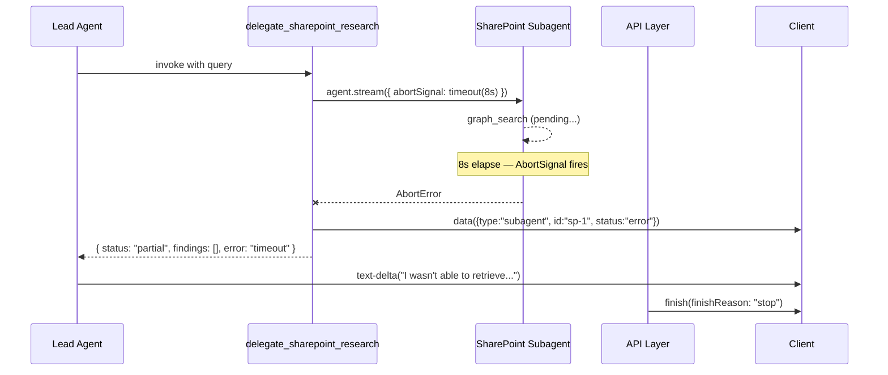

# Error Handling & Limits

A single-turn chatbot has one question: did the model respond or not? A multi-agent system has many. Did any subagent overflow context? Did the SQL loop retry its way past the step ceiling? Did the SharePoint call hang on a Graph API timeout? Did the user hit stop halfway through? Did the turn end without producing a visible answer?

This chapter is about making sure every one of those questions has a clean answer — and that every turn ends in a state the user can see and act on.

## Three Classes of Failure, Three Terminal Outcomes

Multi-agent turns fail in three broad ways:

- **Context overflow.** The prompt being sent on this step is too large, or the next step would be.
- **Runaway tool loops.** An agent keeps calling tools with no convergence — schema exploration turning into forty queries, a search tool retrying empty results forever.
- **Wall-clock stalls.** Nothing has errored. Everything is still "valid." But a Graph API call has been hanging for thirty seconds and the user is watching a spinner.

And any turn — healthy or not — ends in one of four **visible terminal outcomes**:

```
terminal state   | UI presentation                      | stream finishReason
-----------------+--------------------------------------+--------------------
completed        | full answer                          | "stop"
partial          | answer with named gaps + warn cards  | "stop"
cancelled        | "You stopped this turn."             | "abort"
failed (outer)   | error banner + traceId link         | "error"
```

The worst outcome is not on this table. The worst outcome is a silent stall — a turn that reached some terminal backend state but left the user with an empty bubble or a spinning progress card. The rest of this chapter is the machinery that makes that outcome unreachable.

## Layered Controls, Not One Gate

The instinct is to set one number. `maxSteps = 20`. Ship it. That one number will never be right for every failure mode. Soft prompting cannot stop a hard context overflow. A context gate cannot stop an agent that found evidence and is still looping. A terminal step ceiling cannot salvage a partial result once tripped.

Three independent control planes handle the three failure classes:

```
soft budget nudges  ──►  hard gates (prepareStep disables tools)  ──►  terminal ceilings (stopWhen)
       ▲                              ▲                                       ▲
 "you're near the limit —    "continuing would overflow —            "you've run long enough —
 summarize what you know"     stop adding evidence"                   the loop is over"
```

Each plane has a different job:

- A **soft budget** is a prompt-level nudge injected near the limit. "You are near the tool budget. Summarize what you know and name remaining gaps." The agent retains autonomy but gets told to converge.
- A **hard gate** mutates the next step. `prepareStep` strips exploration tools from the toolset once continuing would likely overflow the provider call. The agent still runs, but can only synthesize — it cannot gather more evidence.
- A **terminal ceiling** is a `stopWhen` that ends the loop regardless of what the agent is doing. `stepCountIs(32)` is the canonical one. Wall-clock ceilings via `AbortSignal` are the other.

Soft warnings preserve useful autonomy. Hard gates prevent the final provider call from blowing up. Terminal ceilings keep the whole system bounded even when each individual step looks fine.

## Context Budgets: Measure What the Model Carries

Context budgeting is where naive implementations get a subtle bug. A common mistake is measuring the size of the stored conversation, flagging it safe, then sending a provider request that overflows anyway. The stored transcript and the in-flight prompt are not the same thing.

Track two estimates:

- **Trimmed next-turn estimate.** What will the next turn's starting prompt look like after history trimming? Use this for warnings, diagnostics, and the soft nudge.
- **Untrimmed in-flight estimate.** What is actually being sent to the provider on *this* call, tool results and all? Use this for the hard gate.

These diverge when the current step has just ingested a large tool result that will not survive trimming into the next turn. The next-turn view says safe; the in-flight view says overflow. When the NATP turn's SQL subagent returns a wide result set of past engagements, that result is in-flight right now — that is what the hard gate must measure.

## Tool-Call and Step Budgets

Step budgets are the coarsest terminal ceiling. They stop the loop regardless of what is happening inside.

Three named numbers cover the common case:

- `softToolCallBudget = 24` — the threshold where the soft nudge fires in `prepareStep`
- `maxToolCalls = 30` — the hard gate disables exploration tools at this point
- `stopWhen: [stepCountIs(32)]` — the terminal ceiling, two steps above `maxToolCalls`

That `+2` is deliberate. It is the **synthesis buffer**. When the loop hits the tool budget, the agent still needs at least one more step to produce the answer — and often a second to respond to a `notify_done`-style handoff tool. Set `stopWhen` equal to `maxToolCalls` and the agent will stop with evidence in hand but no chance to write the answer. Always leave room to finalize.

```typescript
// app/agents/lead/leadAgent.server.ts
const SOFT_TOOL_CALL_BUDGET = 24;   // nudge: "start synthesizing"
const MAX_TOOL_CALLS = 30;          // hard gate: disable exploration tools
const STEP_CEILING = MAX_TOOL_CALLS + 2;  // +2 = synthesis buffer

return new Agent({
  model,
  system: leadAgentSystemPrompt,
  tools,
  prepareStep: nearLimitCheckpointer({
    softToolCallBudget: SOFT_TOOL_CALL_BUDGET,
    maxToolCalls: MAX_TOOL_CALLS,
    /* ... */
  }),
  stopWhen: [stepCountIs(STEP_CEILING)],
});
```

## Elapsed-Time Ceilings Per Subagent

Step and context budgets are necessary but they do not catch wall-clock stalls. An agent can be well under its step budget while a single flaky tool hangs for thirty seconds.

Each subagent gets its own wall-clock ceiling via `AbortSignal.timeout`. This matters most where the tool is flaky — the SharePoint subagent runs against Microsoft Graph, which times out plausibly at any reasonable load.

> **For .NET readers:** `AbortSignal` is the web platform's cooperative cancellation token — conceptually the same as `CancellationToken` in .NET. You create one (`AbortSignal.timeout(8_000)` or from a controller) and pass it into any operation that supports cancellation. When it fires, awaited operations throw, streams unwind, and cleanup code runs.

The three NATP subagents get different budgets because their failure modes differ:

| Subagent     | Ceiling | Rationale                                                  |
|--------------|---------|------------------------------------------------------------|
| SharePoint   | 8s      | Graph API is flaky; long hangs are how it fails            |
| SQL          | 30s     | Retry loop is productive — empty results lead to better queries |
| Web research | 15s     | Two or three HTTP fetches, each with their own timeouts    |
| Lead agent   | 60s     | Looser, because subagent time is already bounded below it  |

The Lead Agent's ceiling is intentionally looser. Every child it spawns is already bounded. Its own job is to wait for children and synthesize — the only way it runs long is if it legitimately has more than a minute of children to wait on, at which point a clean timeout is the right answer anyway.

```typescript
// app/agents/lead/tools/delegateSharePointResearch.ts
export const createSharePointResearchTool = (options: {
  writer?: UIMessageStreamWriter<UIMessage>;
}) =>
  tool({
    description: "Search the pre-sales SharePoint folder.",
    inputSchema: z.object({ query: z.string() }),
    execute: async ({ query }, ctx) => {
      // Graph API is flaky — a single subagent call must not stall the whole turn.
      // Combine the parent request signal with a per-subagent timeout.
      const timeout = AbortSignal.timeout(8_000);
      const signal = ctx.abortSignal
        ? AbortSignal.any([ctx.abortSignal, timeout])
        : timeout;

      try {
        const agent = createSharePointAgent();
        const result = await agent.stream({
          messages: [{ role: "user", content: query }],
          abortSignal: signal,
        });

        if (options.writer) {
          await handleSubAgentStream(result, {
            writer: options.writer,
            name: "SharePoint Research",
            parentToolCallId: ctx.toolCallId,
          });
        }

        return { status: "completed", findings: await result.steps };
      } catch (error) {
        // Timeout or cancel — not a turn failure. Return partial so the Lead
        // Agent can still synthesize around the gap.
        return {
          status: "partial",
          findings: [],
          error: signal.reason === "timeout" ? "timeout" : "cancelled",
        };
      }
    },
  });
```

## Cancellation

When the user hits stop, the request's `AbortSignal` fires at the top of the chain and propagates down through every layer that received it. Streams unwind. In-flight tool calls abort. Partial UIMessages already persisted via the placeholder-then-finalize flow (see [09 - Conversation Persistence](./09-conversation-persistence.md)) stay saved.

```
User clicks stop
      │
      ▼
HTTP request aborts
      │
      ▼
API Layer's AbortSignal fires
      │
      ├── Lead Agent's stream aborts
      │       │
      │       ├── delegate_sql_research — SQL subagent aborts mid-query
      │       ├── delegate_sharepoint_research — Graph request aborts
      │       └── delegate_web_research — fetch aborts
      │
      ▼
API Layer emits finish(finishReason: "abort")
      │
      ▼
UI shows "You stopped this turn." — not an error
```

Cancellation is a **cancelled** outcome, not a **failed** outcome. The UI distinguishes the two. A stopped turn is expected behavior; an error banner is not.

## Partial-Result Salvage: The Canonical NATP Example

The SharePoint subagent times out. Eight seconds pass. The Graph API has returned nothing. This is the most common way the NATP turn runs into trouble — and the cleanest example of why partial results are first-class.



Three things to notice:

- The delegation tool catches the abort and returns a **partial result**. It never throws.
- A sideband `subagent.status: "error"` event is emitted so the UI can show the warn state immediately — before the Lead Agent synthesizes.
- The turn's `finishReason` is still `"stop"`, not `"error"`. The turn completed successfully. One source came up short.

The user sees:

```
▼ SQL Agent           [8 tool calls]  ✓ done
▼ SharePoint Agent    [2 tool calls]  ⚠ partial — Graph API timeout after 8s
▼ Web Research Agent  [3 tool calls]  ✓ done

I found 2 past NATP engagements in the project database and recent
public news about their AI initiative. I wasn't able to retrieve
the pre-sales folder from SharePoint — it timed out. You may want
to check that manually.
```

This is a better outcome than an error page. The Lead Agent had enough evidence to produce real value; it just had to acknowledge the gap explicitly.

## Inner Errors vs. Outer Errors

Chapter 02 introduced the two levels. This chapter extends it. The rule is simple and worth stating plainly:

> **A subagent failing is never automatically a turn failing.**

An **inner error** is anything that happens below the Lead Agent's synthesis step: a subagent timeout, a tool throwing, a data source returning 500. Inner errors are caught at the delegation tool boundary, normalized into a partial result, and surfaced to the Lead Agent as evidence about what *did not* work. The Lead Agent treats that like any other input — it synthesizes around the gap.

An **outer error** is something that makes the turn itself unrecoverable: the model provider returns 5xx for the Lead Agent's own call, the stream writer dies, validation failed before the agent even started. Outer errors end the turn. The API Layer emits a terminal `{"type":"error", "error":"<code>"}` event and the client shows an error banner with the trace ID link described in [08 - Telemetry & Tracing](./08-telemetry-and-tracing.md).

```
Inner error (delegation tool handles it):
  SharePoint subagent → Graph API timeout
  delegate_sharepoint_research → { status: "partial", findings: [], error: "timeout" }
  Lead Agent → synthesizes, names the SharePoint gap
  API Layer → finish(finishReason: "stop")    ← turn completed

Outer error (API Layer handles it):
  Lead Agent → model provider returns 503
  API Layer → { type: "error", error: "model_unavailable" }
  Client → error banner with traceId link
```

The only time an inner error becomes an outer error is if *every* source fails in a way that leaves the Lead Agent with zero evidence to synthesize. Even then, the better answer is usually to surface that state as a completed turn with a "no evidence found" answer rather than a hard error.

## Error Normalization

Every provider has a different error shape. OpenAI surfaces `code` and `type` fields. Graph returns `error.innerError.code`. Postgres drivers throw strings. If any of that variance reaches the Lead Agent's reasoning prompt, the prompt starts depending on provider-specific wording — fragile, silently wrong when the wording changes.

Normalize at the boundary. Every delegation tool returns the same envelope:

```typescript
// app/agents/lead/tools/types.ts
export type DelegationResult<TFinding> = {
  status: "completed" | "partial" | "error";
  findings: TFinding[];
  error?: ErrorCode;       // normalized category, not raw provider text
  rawError?: unknown;      // preserved for logs and traces, never for the LLM
};

export type ErrorCode =
  | "timeout"
  | "cancelled"
  | "context_limit"
  | "tool_empty_result"
  | "tool_unavailable"
  | "internal_error";
```

And every terminal outer-error SSE event uses the same shape:

```json
{"type":"error","error":"model_unavailable","traceId":"tr_7x2mn1"}
```

Normalization is not about hiding detail. The `rawError` field and full provider payloads still land in traces where operators need them. Normalization is about giving the Lead Agent and the client UI a stable vocabulary.

## Near-Limit Instructions via prepareStep

When the Lead Agent approaches its tool budget, the loop needs to pivot from exploration to synthesis. A system message injected through `prepareStep` does this cleanly — it reaches the model as instruction rather than retroactively editing history.

```typescript
// app/agents/lead/prepareStep.ts
export const nearLimitCheckpointer = (opts: {
  softToolCallBudget: number;
  maxToolCalls: number;
}): PrepareStepFunction<LeadAgentTools> => async (step) => {
  const toolCallsSoFar = step.stepNumber;

  // Well below soft budget — no intervention.
  if (toolCallsSoFar < opts.softToolCallBudget) return step;

  // Between soft and hard — nudge, don't block.
  if (toolCallsSoFar < opts.maxToolCalls) {
    return {
      ...step,
      messages: step.messages.concat([{
        role: "system",
        content:
          "You are near the tool budget. Summarize what you know so far, " +
          "name any remaining gaps, and ask the user to narrow scope if " +
          "they want deeper work. Do not start new tool exploration.",
      }]),
    };
  }

  // At or past the hard gate — disable exploration tools but keep
  // synthesis/handoff tools active so the agent can still answer.
  return {
    ...step,
    activeTools: ["notify_done"],   // leave this active — see next section
    messages: step.messages.concat([{
      role: "system",
      content:
        "Tool budget reached. Produce the final answer from evidence " +
        "already collected. Label every gap explicitly.",
    }]),
  };
};
```

The nudge is injected as a system message, not user text, so the user never sees it. The hard gate sets `activeTools` to a whitelist — everything not on the list is invisible to the model on this step.

## The Stuck-After-Evidence Trap

The most dangerous mistake when writing a hard gate is disabling *every* tool at once. The agent has evidence, the agent has been told to synthesize, but the handoff tool it needs to declare "done" is also disabled — so it outputs a half-thought and the loop ends on a `stepCountIs` ceiling rather than a clean synthesis.

```
Without synthesis tools preserved (stuck):
  Lead Agent hits maxToolCalls
      │
      ▼
  prepareStep sets activeTools: []   ← disables EVERYTHING
      │
      ▼
  Lead Agent wants to call notify_done — can't
      │
      ▼
  Produces partial text, loop runs out at stepCountIs(32)
      │
      ▼
  UI: partially rendered answer, no finish-step, awkward finish

With synthesis tools preserved (clean):
  Lead Agent hits maxToolCalls
      │
      ▼
  prepareStep sets activeTools: ["notify_done"]   ← handoff still available
      │
      ▼
  Lead Agent synthesizes final answer, calls notify_done
      │
      ▼
  hasToolCall("notify_done") stopWhen fires
      │
      ▼
  Clean finish, full answer, user sees a complete turn
```

The rule: when disabling exploration tools, always keep synthesis and handoff tools active. The distinction between the two is not hard — exploration tools add evidence; handoff tools finish the run. The completion path must stay open.

## Visible Terminal Outcomes

Every turn has to end with something the user can see. Chapter 09 covers the mechanic — an assistant placeholder is inserted at stream start and reconciled into the final message at finish. This chapter adds the rule: the reconciliation must always produce visible content.

Before the API Layer calls `finish`, a finalization guard inspects the last assistant message:

- If it has visible text, emit `finish(finishReason: "stop")` and persist normally.
- If it is empty but tools ran, inject a deterministic fallback: *"I was unable to produce a full answer. Partial findings above."*
- If the turn was cancelled, inject: *"You stopped this turn."* Emit `finish(finishReason: "abort")`.
- If an outer error fired, emit `{"type":"error", "error":"<code>", "traceId":"tr_7x2mn1"}` and render the banner with a trace link.

```
terminal state   | UI presentation                      | stream finishReason
-----------------+--------------------------------------+--------------------
completed        | full answer                          | "stop"
partial          | answer with named gaps + warn cards  | "stop"
cancelled        | "You stopped this turn."             | "abort"
failed (outer)   | error banner + traceId link          | "error"
```

Four terminals. No fifth. "Silent stall" is not on the list because it is never allowed to ship.

## Key Takeaways

- Three planes — soft budget, hard gate, terminal ceiling — each cover a different failure class. One number is never enough.
- Track two context estimates: trimmed next-turn for warnings, untrimmed in-flight for hard gates. The gap between them is where overflows hide.
- Always leave a synthesis buffer — `stepCountIs(maxToolCalls + 2)` — so the agent can actually answer after its last tool call.
- Each subagent gets its own wall-clock ceiling via `AbortSignal.timeout`. SharePoint 8s, SQL 30s, Web 15s. Lead Agent is looser because its children are bounded.
- Inner errors are caught at the delegation boundary and returned as `{status: "partial"}`. A subagent failing is never automatically a turn failing.
- Every delegation tool returns the same envelope; every outer error uses the same SSE shape. Provider-specific shapes never reach the Lead Agent's reasoning.
- When disabling exploration tools at the hard gate, keep synthesis and handoff tools active. The stuck-after-evidence trap is the most common mistake.
- Every turn ends in one of four visible terminal states. Silent stall is not allowed.

## Related Sections

- [02 - Request Flow & Streaming](./02-request-flow-and-streaming.md): The "Error Handling: Two Levels" foundation this chapter extends.
- [04 - Subagent Fan-Out Pattern](./04-subagent-fanout-pattern.md): Delegation tool boundaries where inner errors are caught and normalized.
- [07 - Specialized Execution Subagent](./07-sql-subagent-deep-dive.md): How an individual subagent sets its own step budget and handoff tool.
- [08 - Telemetry & Tracing](./08-telemetry-and-tracing.md): The trace ID that error banners link to for operator diagnosis.
- [09 - Conversation Persistence](./09-conversation-persistence.md): Placeholder-then-finalize, which guarantees partial work survives cancellation.
