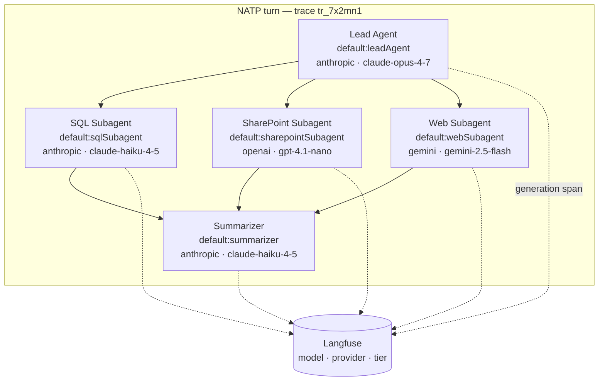

# Model Selection & Registry

When the NATP turn runs, six different model calls happen under the hood. The Lead Agent reasons through the request and delegates. The SQL subagent churns through eight tool calls in a tight loop. The SharePoint subagent summarizes filenames and metadata. The Web subagent reads pages and extracts context. After the subagents report back, a summarizer polishes the final answer. A small follow-ups pass generates suggested next questions.

Each of those jobs wants a different model. The Lead Agent wants strong reasoning with a generous output budget. The SQL subagent wants something cheap and fast because its work is bounded and mechanical. The SharePoint subagent wants something even smaller. The Web subagent benefits from a model with strong web-reasoning. The summarizer and follow-ups are short one-shot calls where paying for Opus-class reasoning is waste.

If the decisions about **which** model handles each role are scattered across agent factories, tool implementations, and prompt files, changing any of it becomes a grep-and-pray exercise. The fix is a central **registry** that maps stable role names to concrete provider models. Agent code asks for `default:leadAgent` or `default:sqlSubagent`; the registry decides what that means today.

.NET readers: think of this like a typed DI container that maps a service interface to a concrete implementation. `ILeadAgentModel` resolves to a specific class in one place. Every caller just asks for the interface.

## Model Selection Belongs in Infrastructure

If orchestration code contains the string `claude-opus-4-7` or `gpt-5-mini`, you have a problem. It means:

- Changing the Lead Agent's model requires editing the Lead Agent's source, which lives next to prompts and tool wiring.
- Swapping providers during an incident is a multi-file diff.
- Two tools that should share a tier drift apart because no one noticed.
- Tests have to reach into prompt code to inject fakes.

The agent should describe what it needs by role, not by vendor. It needs "lead orchestration reasoning," not "Claude Opus 4.7." The registry — infrastructure code — turns that role into a concrete model with the right defaults applied.

This is the same instinct that keeps database connection strings out of business logic. Agent code should not know which provider is paying for its tokens this week.

## Two Layers: Providers and Tiers

A working registry has two layers:

```
Provider factories (auth, clients)
       │
       ▼
Named tiers (default:leadAgent, default:sqlSubagent, ...)
       │
       ▼
Agent code calls modelRegistry.languageModel("default:leadAgent")
```

**Layer 1 — provider factories.** Each vendor gets initialized once with its API key and any client-level configuration. Nothing else in the system creates provider clients.

**Layer 2 — named tiers.** A `default:` namespace maps role names to wrapped models. Each tier bundles the provider model with the default settings and middleware that role needs.

Raw providers stay accessible for the rare case where a tool needs a provider-specific feature. But they are an escape hatch — not the main road.

## The Registry Definition

Here is the full NATP registry. Six tiers — one per role described in earlier chapters — plus the raw providers exposed as named entries for deliberate exceptions.

```typescript
// app/common/modelRegistry.ts
import { createAnthropic } from "@ai-sdk/anthropic";
import { createOpenAI } from "@ai-sdk/openai";
import { createGoogleGenerativeAI } from "@ai-sdk/google";
import { createXai } from "@ai-sdk/xai";
import {
  createProviderRegistry,
  customProvider,
  defaultSettingsMiddleware,
  wrapLanguageModel,
} from "ai";
import { ensureFinishUsageMiddleware } from "./modelMiddleware";

// Provider factories — initialized once, reused everywhere.
export const modelProviders = {
  anthropic: createAnthropic({ apiKey: process.env.ANTHROPIC_API_KEY! }),
  openai: createOpenAI({ apiKey: process.env.OPENAI_API_KEY! }),
  gemini: createGoogleGenerativeAI({ apiKey: process.env.GOOGLE_GENERATIVE_AI_API_KEY! }),
  xai: createXai({ apiKey: process.env.XAI_API_KEY! }),
};

export const modelRegistry = createProviderRegistry(
  {
    default: customProvider({
      languageModels: {
        // Lead Agent — reasoning-heavy orchestration of the NATP turn.
        leadAgent: wrapLanguageModel({
          model: modelProviders.anthropic("claude-opus-4-7"),
          middleware: [
            defaultSettingsMiddleware({
              settings: {
                maxOutputTokens: 8_000,
                temperature: 1,
                providerOptions: {
                  anthropic: {
                    thinking: { type: "enabled", budgetTokens: 12_000 },
                  },
                },
              },
            }),
            ensureFinishUsageMiddleware(),
          ],
        }),

        // SQL subagent — tight loop over a bounded schema.
        sqlSubagent: wrapLanguageModel({
          model: modelProviders.anthropic("claude-haiku-4-5"),
          middleware: [
            defaultSettingsMiddleware({
              settings: {
                maxOutputTokens: 4_000,
                temperature: 0.2,  // deterministic SQL drafting
              },
            }),
            ensureFinishUsageMiddleware(),
          ],
        }),

        // SharePoint subagent — metadata summary; stays light.
        sharepointSubagent: wrapLanguageModel({
          model: modelProviders.openai("gpt-4.1-nano"),
          middleware: [
            defaultSettingsMiddleware({
              settings: { maxOutputTokens: 2_000, temperature: 0.3 },
            }),
            ensureFinishUsageMiddleware(),
          ],
        }),

        // Web subagent — reads and reasons over fetched pages.
        webSubagent: wrapLanguageModel({
          model: modelProviders.gemini("gemini-2.5-flash"),
          middleware: [
            defaultSettingsMiddleware({
              settings: { maxOutputTokens: 6_000, temperature: 0.5 },
            }),
            ensureFinishUsageMiddleware(),
          ],
        }),

        // Final-answer polish after subagents report back.
        summarizer: wrapLanguageModel({
          model: modelProviders.anthropic("claude-haiku-4-5"),
          middleware: [
            defaultSettingsMiddleware({
              settings: { maxOutputTokens: 3_000, temperature: 0.4 },
            }),
            ensureFinishUsageMiddleware(),
          ],
        }),

        // One-shot suggestion generator for "what to ask next."
        followups: wrapLanguageModel({
          model: modelProviders.openai("gpt-4.1-nano"),
          middleware: [
            defaultSettingsMiddleware({
              settings: { maxOutputTokens: 600, temperature: 0.7 },
            }),
            ensureFinishUsageMiddleware(),
          ],
        }),
      },
    }),

    // Raw providers — available by name for the rare explicit exception.
    anthropic: modelProviders.anthropic,
    openai: modelProviders.openai,
    gemini: modelProviders.gemini,
    xai: modelProviders.xai,
  },
  { separator: ":" },
);
```

Two things to notice. First, every tier flows through `wrapLanguageModel` with the same middleware stack — the registry is where defaults live, not the agent. Second, the raw providers are still registered by name, but they are siblings to `default:` rather than the default path.

## Why Each NATP Role Gets Its Own Tier

A one-size-fits-all "just use the smartest model" approach wastes money and latency. Each NATP role has a different shape, and that shape tells you what it needs.

```
role                 tier                          example model        rationale
-------------------  ----------------------------  -------------------  ------------------------------
lead orchestration   default:leadAgent             Claude Opus 4.7      strong reasoning, 8k output
SQL loop             default:sqlSubagent           Claude Haiku 4.5     tight loop, cheap per-step
SharePoint summary   default:sharepointSubagent   GPT-4.1-nano         metadata-only, short outputs
web reading          default:webSubagent           Gemini 2.5 Flash     web-reasoning tier, fast reads
final polish         default:summarizer            Claude Haiku 4.5     short synthesis over evidence
suggested followups  default:followups             GPT-4.1-nano         one-shot prompt, no reasoning
```

The NATP Lead Agent actually reasons — it has to decide which data sources matter, interpret partial results, and write a grounded answer. Reasoning-enabled with an 8k output budget is appropriate.

The SQL subagent iterates. It explores a schema, drafts a query, retries on empty results, joins related tables. Its context is bounded (one database's schema) and each step is mechanical. A cheap, fast model runs this loop eight times without blowing the latency or cost budget.

The SharePoint subagent is even lighter. It lists files, reads names, and summarizes what exists. Running this on Opus would be like hiring a senior engineer to rename files.

The Web subagent reads pages. Some providers publish tiers tuned for web-reasoning — a Gemini Flash class is a good fit because it balances reading comprehension with throughput.

Summarizer and follow-ups are one-shot calls with tight output caps. Nano-class models are built for this.

## Named Capabilities, Not Raw Model IDs

The registry gives agent code a vocabulary of **named capabilities**. The Lead Agent factory does not know what model it is running. It asks for a role.

```typescript
// app/agents/lead/leadAgent.server.ts
export function createLeadAgent(config: {
  writer?: UIMessageStreamWriter<UIMessage>;
  model?: LanguageModel;   // optional injection — used by tests
  telemetry?: TelemetryConfig;
}) {
  const tools = buildLeadAgentTools({ writer: config.writer });

  return new Agent({
    // The factory asks for a role. The registry decides what it is today.
    model: config.model ?? modelRegistry.languageModel("default:leadAgent"),
    system: buildLeadAgentSystemPrompt({ /* ... */ }),
    tools,
    experimental_telemetry: {
      isEnabled: true,
      functionId: "leadAgent",
      ...config.telemetry,
    },
  });
}
```

No provider string appears. No API key appears. If the registry swaps the Lead Agent to a different model tomorrow, this factory does not change.

The SQL, SharePoint, and Web subagent factories follow the identical shape — each asks for its own tier.

## Swapping Providers by Role

When Anthropic has a bad afternoon, you want to move the SQL subagent over to OpenAI without touching prompts, tools, or agent code. The registry makes that a one-line change.

```
Before — Anthropic is flaky:
  sqlSubagent: wrapLanguageModel({
    model: modelProviders.anthropic("claude-haiku-4-5"),
    middleware: [ /* ... */ ],
  }),

After — move SQL subagent to OpenAI:
  sqlSubagent: wrapLanguageModel({
    model: modelProviders.openai("gpt-4.1-mini"),
    middleware: [ /* ... */ ],
  }),
```

That is the whole diff. The SQL subagent's prompt, tools, delegation wiring, and tests do not change. The Lead Agent still delegates via `delegate_sql_research`. The UI still renders the same progress card. Only the registry entry moved.

Contrast that with the alternative. Without a registry, the same swap means touching every call site that hard-codes `anthropic("claude-haiku-4-5")`. At best you forget one and two subagents diverge; at worst you edit a prompt file and trip a silent behavior change.

## Middleware for Normalization

Every provider returns slightly different shapes for the things telemetry and cost tracking care about. OpenAI's `finishReason` vocabulary is not identical to Anthropic's. Some providers occasionally emit a finish chunk without usage tokens attached. Gemini reports token counts in a different nested shape.

Middleware wrapped around each tier normalizes this once — so downstream code never has to special-case providers.

```typescript
// app/common/modelMiddleware.ts
import type { LanguageModelMiddleware } from "ai";

/**
 * Guards against providers that occasionally emit a finish chunk with no
 * usage object, and normalizes the shape so trace exporters never crash
 * on a missing `usage.inputTokens`.
 */
export function ensureFinishUsageMiddleware(): LanguageModelMiddleware {
  return {
    specificationVersion: "v3",
    wrapStream: async ({ doStream }) => {
      const result = await doStream();
      return {
        ...result,
        stream: result.stream.pipeThrough(
          new TransformStream({
            transform(chunk, controller) {
              if (chunk.type === "finish") {
                controller.enqueue({
                  ...chunk,
                  usage: normalizeUsage((chunk as any).usage),
                  // Normalize finishReason so cross-provider traces line up:
                  // "stop" / "length" / "tool-calls" / "error".
                  finishReason: normalizeFinishReason(chunk.finishReason),
                });
                return;
              }
              controller.enqueue(chunk);
            },
          })
        ),
      };
    },
  };
}

function normalizeUsage(usage: unknown) {
  /* ... coerce to { inputTokens: {...}, outputTokens: {...} } ... */
}

function normalizeFinishReason(reason: string | undefined) {
  /* ... map provider-specific reasons onto a small canonical set ... */
}
```

Because every tier goes through `wrapLanguageModel({ model, middleware: [...] })`, the normalization is automatic. Agent code, trace exporters, and cost-attribution code all see the same shape whether the tier is backed by Anthropic, OpenAI, or Gemini.

Middleware is also the right place for:

- **Usage extraction** — pulling token counts out of each finish chunk and attaching them to the active span.
- **Cost attribution** — multiplying token counts by the provider's per-million rates and tagging the span with a dollar value.
- **Default settings** — `defaultSettingsMiddleware` lets each tier declare its `maxOutputTokens`, `temperature`, and provider-specific reasoning flags in one place.

Everything that belongs to "how models behave in this system" goes in the middleware stack. Nothing like that belongs in prompts or tools.

## Cost and Tier Tuning in One File

Because every call site flows through named tiers, you can change the NATP system's cost profile by editing one file. Three realistic examples:

**Incident investigation.** The SQL subagent is getting stuck in retry loops. Bump it from Haiku to a mid-tier for a week so it writes better queries on the first try:

```
sqlSubagent: wrapLanguageModel({
-  model: modelProviders.anthropic("claude-haiku-4-5"),
+  model: modelProviders.anthropic("claude-sonnet-4-5"),
  /* ... */
}),
```

No prompts change. No tool definitions change. The SQL subagent just starts making fewer mistakes.

**Cost reduction after launch.** The summarizer was over-provisioned. Drop it from Haiku to nano once you are confident the prompt is stable:

```
summarizer: wrapLanguageModel({
-  model: modelProviders.anthropic("claude-haiku-4-5"),
+  model: modelProviders.openai("gpt-4.1-nano"),
  /* ... */
}),
```

**Seasonal capacity.** A provider is rate-limiting you during business hours. Move one tier to a different provider while leaving the rest in place. The only place that changes is the registry.

## Exceptions for Provider-Specific Features

Some subagents need something the generic abstraction does not express. The NATP Web subagent, for example, may want a provider's native web-search tool — that is a provider-specific capability that the shared middleware cannot normalize.

For those cases, the registry exposes raw providers by name. The Web subagent is allowed to ask for one directly:

```typescript
// app/agents/web/webSubagent.server.ts
import { modelRegistry } from "~/common/modelRegistry";

export function createWebSubagent(/* ... */) {
  return new Agent({
    // Escape hatch — use a raw provider because we need its native web tools.
    model: modelRegistry.languageModel("openai:gpt-4.1"),
    tools: { /* provider-specific search tool */ },
    /* ... */
  });
}
```

Two things make this safe:

1. The escape hatch is **explicit**. `modelRegistry.languageModel("openai:gpt-4.1")` is visibly different from the default path. A code reviewer will notice it.
2. It is **the exception, not the rule**. If half the agents reach for raw providers, the abstraction has failed. Track exceptions — one or two are fine; ten means the registry needs a new tier.

The goal is roughly 95% of agent code going through `default:*`, with the remaining 5% being obvious and auditable.

## Testing Hooks

The factory's optional `model` parameter exists precisely so tests can override the registry without monkey-patching it. Pass a scripted mock model in, and the agent runs against it.

```typescript
// app/agents/lead/leadAgent.test.ts
import { test, expect } from "bun:test";
import { MockLanguageModelV3 } from "ai/test";
import { createLeadAgent } from "./leadAgent.server";

test("Lead Agent delegates to SQL subagent for a NATP projects question", async () => {
  // Scripted mock — returns a tool call, then a final message.
  const mockModel = new MockLanguageModelV3({
    doStream: async () => ({
      stream: simulateReadableStream([
        { type: "tool-call", toolCallId: "tc_0", toolName: "delegate_sql_research",
          input: JSON.stringify({ query: "past NATP engagements" }) },
        { type: "finish", finishReason: "tool-calls",
          usage: { inputTokens: { total: 500 }, outputTokens: { total: 50 } } },
      ]),
    }),
  });

  const agent = createLeadAgent({ model: mockModel });
  const result = await agent.stream({
    messages: [{ role: "user", content: "What projects have we done with NATP?" }],
  });

  const toolCalls = await collectToolCalls(result);
  expect(toolCalls[0].toolName).toBe("delegate_sql_research");
});
```

The same trick works for any tier. Integration tests can override only the one role they care about and let the rest flow through the real registry. This is how you write a test that asserts "the Lead Agent always delegates the SQL branch" without paying for real Opus tokens on every CI run.

## Observability Metadata

Every registered model carries identifying metadata into the trace. Langfuse (see [08 - Telemetry & Tracing](./08-telemetry-and-tracing.md)) receives the provider name, model ID, and tier name on every generation span. That means when you open the trace for `tr_7x2mn1` you can pivot analysis by any of the three.



Three things to notice:

- Each agent's generation span records the **tier** it asked for, not just the underlying model. That lets you answer "how is `default:sqlSubagent` performing?" even after you have swapped its concrete model three times.
- Provider and model ID are on the span too, so cost and latency can be sliced by vendor.
- When you re-run the same turn after changing the SQL tier, old traces still reference the old model and new traces reference the new one — you can compare them directly.

## Versioning and Rollouts

When you want to A/B test a new Lead Agent model, do not edit `default:leadAgent` in place. Add a sibling tier:

```typescript
// inside the languageModels block
leadAgent: wrapLanguageModel({ model: modelProviders.anthropic("claude-opus-4-7"), /* ... */ }),

leadAgentV2: wrapLanguageModel({
  model: modelProviders.anthropic("claude-opus-4-8-preview"),
  middleware: [ /* same middleware stack, possibly tuned */ ],
}),
```

Then gate the selection on a feature flag:

```typescript
// app/agents/lead/leadAgent.server.ts
const tier = featureFlags.leadAgentV2 ? "default:leadAgentV2" : "default:leadAgent";
const model = config.model ?? modelRegistry.languageModel(tier);
```

With both tiers live, traces record which one ran each turn. You can compare latency, failure rate, and tool-call counts between `default:leadAgent` and `default:leadAgentV2` in Langfuse, then promote the winner by repointing the flag. Once the new model is the default, drop the old tier.

The rule is: **never rename the old one**. Agent code refers to `default:leadAgent` by that exact string. Rename it and every caller breaks at once.

## Stable Defaults, Escape Hatch for the Rest

The point of all this is a simple contract:

- **95% of agent code** resolves models through `default:*` tiers. No provider strings, no API keys, no model IDs.
- **The remaining 5%** uses the raw providers — explicitly, and only when the shared abstraction genuinely does not fit.
- **100% of default settings and normalization middleware** live in one file.

That division makes the codebase easy to audit. A new engineer searching for "which models does this app run?" finds one file. A cost-review meeting changes spending by editing one file. An incident response swaps providers by editing one file. And the traces always line up because they all flow through the same middleware.

## Key Takeaways

- Agents should ask for named capabilities (`default:leadAgent`), never raw provider model IDs. If orchestration code contains a vendor string, the abstraction has leaked.
- The registry has two layers: raw provider factories for initialization and auth, and named tiers under a `default:` namespace for roles.
- Each NATP role gets its own tier because each has a different reasoning, latency, and cost profile. One-size-fits-all wastes money on SQL and starves the Lead Agent.
- Middleware wrapped around every tier normalizes `finishReason`, usage shapes, and default settings so downstream code never special-cases providers.
- Provider swaps, cost tuning, and rollouts happen in one file — prompts and tools do not change.
- Raw providers stay available as an explicit escape hatch for provider-specific features. Keep them rare and obvious.
- Tests override a single tier by injecting a mock model through the factory, without touching the registry itself.

## Related Sections

- [03 - Agent Architecture](./03-agent-architecture.md): How the Lead Agent factory resolves its model from the registry and injects it into the `Agent` constructor.
- [04 - Subagent Fan-Out Pattern](./04-subagent-fanout-pattern.md): Each delegation tool constructs its subagent with its own tier — another reason tiers beat hard-coded IDs.
- [07 - Specialized Execution Subagent](./07-sql-subagent-deep-dive.md): Why the SQL subagent's tight-loop shape justifies a cheaper tier than the Lead Agent.
- [08 - Telemetry & Tracing](./08-telemetry-and-tracing.md): How tier, provider, and model ID flow onto every generation span so you can pivot trace analysis by any of them.
- [10 - Error Handling & Limits](./10-error-handling-and-limits.md): Budget guardrails that complement tier selection — cheaper tiers still need step and time ceilings.
