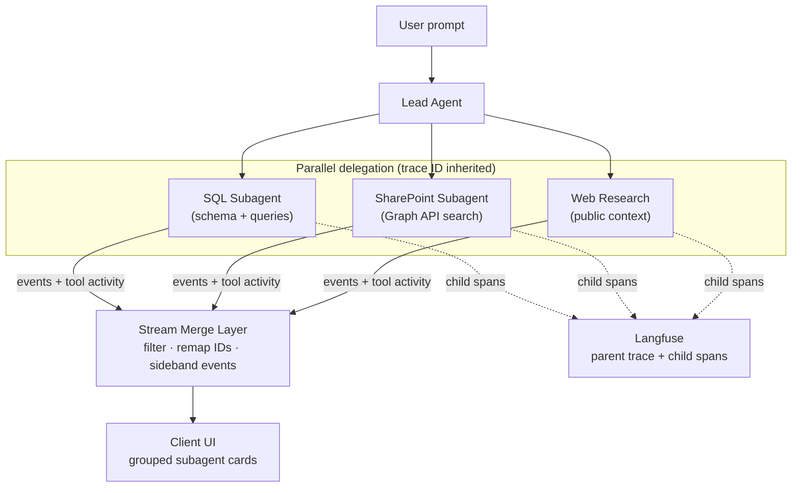

# Multi-Agent Web App Patterns with AI SDK

A guide for the patterns that make multi-agent systems reliable in production.

## What This Guide Is About (and What It Isn't)

An "AI project" can mean two different things that are easily conflated:

|                         | Agentic coding                                              | Building an AI application                                      |
| ----------------------- | ----------------------------------------------------------- | --------------------------------------------------------------- |
| **Who talks to the AI** | Developer, during authoring. End user never sees AI.        | End user, at runtime. The developer builds the system.          |
| **What ships**          | A traditional app, API, or service with no AI inside       | An AI system: chat UI, agents, tools, streaming state           |
| **Examples**            | Claude Code, Codex, Cursor, Copilot + homegrown dev scripts | An internal consulting agent at a professional services firm that answers questions across the project database, SharePoint, and the public web |

**This guide is about the second.** You are not using AI to help you build; you are building the AI (but also probably via agentic coding...).

Everything that follows (streaming, subagent orchestration, typed UI message protocols, tool call reconciliation, model routing, resume flows) is operational concern inside an AI runtime. These are new concepts that haven't mattered in traditional apps, but they are critical when you are building the AI system itself.


|                    | Traditional app                                                  | AI app                                                                                                            |
| ------------------ | ---------------------------------------------------------------- | ----------------------------------------------------------------------------------------------------------------- |
| **Response shape** | Fixed JSON/HTML; milliseconds to a few seconds                   | SSE stream held open for seconds to minutes; duration and call count unknown upfront                              |
| **Control flow**   | Explicit if/then paths written into the code up front            | Flow lives in the prompt; the model picks tools and ordering at runtime. Flexible but hard to predict.            |
| **Error model**    | Exceptions trace straight to the code bug                             | A wrong model decision is still a structurally valid action, so nothing throws                                    |
| **Observability**  | Optional because deterministic code lets you walk from input to output  | Required. The agentic loop is non-deterministic, so the trace tree is the only way to see what actually happened  |

If you are looking for "how to use AI to build faster," this isn't it. If you are building a product where the AI *is* the product, read on.

## A Real-World Scenario

Consider this prompt from a consultant at a professional services firm:

> *"I just had a call with NATP. What projects have we done with them in the past, and do we have any pre-sales artifacts already saved for this new tax agent project?"*

Answering this requires three different data sources. A lead agent decides it cannot answer from context alone and delegates to three specialists running in parallel:

```
Lead Agent
├── SQL Subagent        → query project database for past NATP engagements
├── SharePoint Subagent → search pre-sales folder via Graph API for pitch decks and SOW drafts
└── Web Research Agent  → look up NATP's public announcements and recent news
```

The SQL subagent alone will make roughly **eight tool calls**: explore schema, attempt a query, handle an empty result, rewrite the query with a broader match, join related tables for team assignments, and so on. The other two subagents have their own iterative loops.

The user should start seeing progress within seconds. But getting there correctly is harder than it looks.

### Why Streaming in the First Place

A simple LLM call often takes 20 to 60 seconds, and sophisticated AI system can run for minutes, mostly before the lead agent writes a token. We can't fix the latency, so we stream progress signals (*"searching SharePoint... three files found..."*) to keep the user from staring at a spinner.

Streaming one agent is hard enough. Once three subagents are firing in parallel into the same connection, each with its own tokens and tool events, the new problem is keeping all of that output organized.

### Merging the Streams

#### Concurrent streams become unreadable when merged naively

Three agents running in parallel each emit their own event stream. Merged without structure, the user sees an impossible to follow mess:

```
[SQL]        explore_schema()                                     → running
[SharePoint] graph_search("NATP pre-sales")                      → running
[Web]        web_search("NATP tax organization 2025")            → running
[SQL]        execute_query("...WHERE client LIKE '%NATP%'")      → 0 rows
[SQL]        rewrite_query()                                      → retrying
[SharePoint] list_files("/sites/presales/NATP")                  → 3 files found
[Web]        read_page("natp.org/announcements")                 → reading
[SQL]        execute_query("...WHERE name ILIKE '%national%tax%'") → 2 rows
...
```

This is technically complete but practically unreadable. The user cannot tell which agent is making progress, which is stuck, or what any given tool call is trying to accomplish.

#### The UI needs grouping, not a flat list

The right experience presents subagent activity as collapsible groups:

```
▼ SQL Agent           [8 tool calls]  ✓ done
▼ SharePoint Agent    [4 tool calls]  ✓ done
▼ Web Research Agent  [3 tool calls]  ✓ done

Answer: Here's what we found...
```


#### Trace propagation must cross delegation boundaries

When something goes wrong (or when you need to understand why the SQL agent made eight calls instead of two), you need to see the full picture as one distributed trace:

```
Root trace: "NATP projects query"                  12.3s
  └── Lead Agent                                    2.1s
       └── delegate_research (tool call)
            ├── SQL Subagent                        6.1s
            │    ├── explore_schema                 43ms
            │    ├── execute_query (attempt 1)      210ms  → 0 rows
            │    ├── execute_query (attempt 2)      189ms  → 2 rows
            │    └── fetch_project_details          340ms
            ├── SharePoint Subagent                 4.2s
            │    ├── graph_search                   800ms  → 3 docs
            │    └── read_document                  1.1s
            └── Web Research Subagent               3.8s
                 ├── web_search                     1.2s
                 └── read_page                      900ms
```

Without trace propagation, each subagent creates its own root trace and the distributed execution looks like four unrelated operations. You lose total latency, failure attribution, and the ability to understand how parallel branches played out. Every subagent must run **under the same parent trace ID**, inherited from the lead agent's turn.

### System Shape



## The Tech Stack in Layers

Every AI application has the same set of layers, regardless of language or framework. Understanding each layer's responsibility as a first principle lets you translate these patterns into whatever stack your team uses. The libraries chosen in this guide are one working set. They are not prescriptive. The *patterns* are the portable part.

```
Client UI layer        → React + AI SDK useChat hook
HTTP / API layer       → TypeScript on Node + React Router API (SSE)
Agent & tool layer     → AI SDK (TypeScript)
Model provider layer   → AI SDK provider adapter
Persistence layer      → Postgres (messages, runs, conversations)
Observability layer    → OpenTelemetry + Langfuse
```

### Client UI layer

**What it must do.** Render the chat experience end to end: assistant text, tool calls, reasoning tokens, subagent progress cards, final answers. It has to handle two paths that must produce the same UI:

1. **Rehydrate** a persisted conversation from history (the user refreshed the tab).
2. **Consume a live SSE stream** for a turn in progress (the user just sent a message).

**What it requires.** A UI framework that can reduce a stream of typed events into component state and render incrementally. Consumers must handle out-of-order arrivals, mid-stream reconciliation, and tool-call updates that arrive in pieces.

**What this guide uses.** React with the AI SDK `useChat` hook, plus custom components for subagent progress panels. Vue, Svelte, Solid, or hand-rolled reducers all work if they can handle typed event reduction.

### HTTP / API layer

**What it must do.** Accept the user turn, kick off the agent run, and stream Server-Sent Events back to the client while keeping the connection open until the turn finishes. Persist state incrementally along the way.

**What it requires.** A server runtime that supports long-lived responses and writing to the response body while the request is still open. Any framework that can emit `text/event-stream` works. Frameworks that buffer responses fully do not.

**What this guide uses.** TypeScript on Node with a React Router API handler. Equivalents include .NET minimal APIs with `IAsyncEnumerable<T>`, ASP.NET Core with SSE middleware, Go's `http.Flusher`, FastAPI's `StreamingResponse`, Phoenix's streaming responses. The contract is SSE; the runtime is your choice.

### Agent & tool layer

**What it must do.** Interpret the user's intent, decide when to call tools, delegate narrow work to subagents, run the agent loop with stop conditions, and synthesize a final answer. Guardrails live here too: step limits, timeouts, tool-call budgets.

**What it requires.** A library that can model an agent loop, define tools with typed inputs and outputs, enforce stop conditions, and write events into a shared stream so the HTTP layer can forward them.

**What this guide uses.** AI SDK (TypeScript). Alternatives: Mastra, LangChain (Python or TypeScript), LangGraph, Microsoft Semantic Kernel, Google ADK. The patterns in this guide (lead agent, delegated subagents, typed tools, structured results) translate to any of them; only the specific type names change.

### Model provider layer

**What it must do.** Send structured prompts and tool definitions to a language model, receive streaming responses with tool calls, and report usage metadata (tokens, finish reason) back up the stack.

**What it requires.** A provider SDK that supports streaming and native tool calling. Completion-only or batching-only SDKs cannot support the real-time UX this guide assumes.

### Persistence layer

**What it must do.** Store canonical conversation state (messages, runs, tool results) durably enough that a page refresh, server restart, or network blip doesn't lose the user's work. Writes must happen *during* the stream, not only at the end.

**What it requires.** A database that can accept frequent incremental writes, plus a schema that separates conversations, runs, and messages so resume logic can attach to the right record.

**What this guide uses.** Postgres with a three-table schema (`conversations`, `runs`, `messages`). SQLite, MySQL, SQL Server, or any relational store works. The pattern is write-through-during-stream with clean record separation, not any specific database.

### Observability layer

**What it must do.** Capture the full tree of what happened in a turn (which agent ran, which tools were called, which model was used, how long each span took, what errors occurred) so you can debug failures, tune prompts, and correlate user reports with back-end activity.

**What it requires.** A tracing system that accepts nested spans from multiple runtime layers under a shared trace ID, and an SDK that propagates trace context across delegation boundaries (lead agent → subagent → tool).

**What this guide uses.** OpenTelemetry instrumentation with Langfuse as the trace backend. Any OTEL-compatible store works: Jaeger, Tempo, Honeycomb, Datadog, Azure Monitor, AWS X-Ray.

## What This Guide Covers

The example prompt above is not unusual. Any multi-agent system that queries multiple data sources, runs agents in parallel, and surfaces results in real time will hit the same challenges. The chapters that follow describe a production-ready pattern with these characteristics:

- **One user-visible stream, many internal actors**. A single response stream carries assistant text, tool activity, subagent progress, and terminal outcomes back to the client.
- **A lead agent owns the conversation**. It interprets the request, decides when tools are enough, and delegates only the parts that benefit from specialization.
- **Subagents are narrow and disposable**. They get a constrained objective, a bounded toolset, and explicit runtime limits. They are components, not independent products.
- **Messages are structured data, not loose strings**. The UI consumes typed message parts and metadata rather than inferring behavior from raw text.
- **Runs are durable**. Conversation state is persisted as canonical message history, and stream metadata is emitted early enough for reconnect, resume, and debugging flows.
- **Observability is part of the protocol**. Trace IDs, run IDs, and correlation metadata travel with the execution path rather than being bolted on later.
- **Prompts are validated before they reach the model**. Persisted or client-submitted messages get repaired on the way in; malformed tool state and empty prompts fail early.
- **Bounded execution**. Step limits, timeout budgets, and concurrency caps keep agents converging instead of wandering.

Implementation details vary by framework, model provider, or storage backend, but the system design principles are stable. The hard part is not getting an agent to answer once. It is making the answer stream, persist, trace, recover, and terminate correctly every time.

## How To Read This Guide

- **Read sequentially** for the full architecture, from request flow through orchestration, streaming, persistence, and limits.
- **Jump by problem** if you are solving one concrete issue such as subagent fan-out, typed message design, resume flows, or tracing.
- **Use it as a design checklist** if you are building a new system and want to avoid the common demo-to-production failures.

The examples in later chapters come from real implementation patterns, but the goal is broader than any one stack. You should be able to adapt the ideas here to your own transport layer, UI framework, persistence model, and model provider choices.

### Chapters

1. [01 - Architecture Overview](./01-architecture-overview.md): the high-level shape of a lead-agent plus delegated-subagent system.
2. [02 - Request Flow & Streaming](./02-request-flow-and-streaming.md): how requests become typed streams and why stream shape matters.
3. [03 - Agent Architecture](./03-agent-architecture.md): tool-driven orchestration, stop conditions, and guardrails.
4. [04 - Subagent Fan-Out Pattern](./04-subagent-fanout-pattern.md): parallel delegation, stream merging, and collision avoidance.
5. [05 - Type Safety & Custom UI Messages](./05-type-safety-and-custom-ui-messages.md): typed metadata, tool parts, and custom data parts.
6. [06 - UI Rendering](./06-ui-rendering.md): rendering streamed structured state as an inspectable interface.
7. [07 - SQL Subagent Deep Dive](./07-sql-subagent-deep-dive.md): an end-to-end worked example of a narrow-scope execution subagent.
8. [08 - Telemetry & Tracing](./08-telemetry-and-tracing.md): trace propagation, metadata, and production observability.
9. [09 - Conversation Persistence](./09-conversation-persistence.md): persisting canonical messages for refresh, resume, and recovery.
10. [10 - Error Handling & Limits](./10-error-handling-and-limits.md): timeouts, partial failure, message repair, and orchestration budgets.
11. [11 - Model Selection & Registry](./11-model-selection-and-registry.md): role-based model routing and centralized model defaults.
